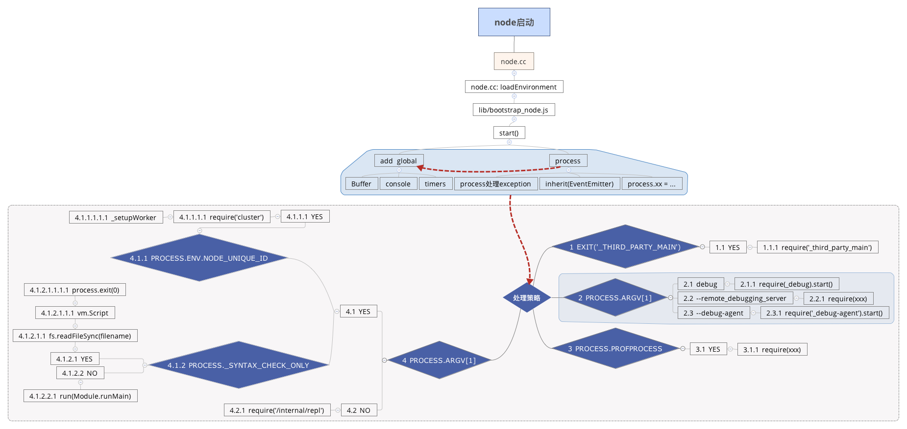
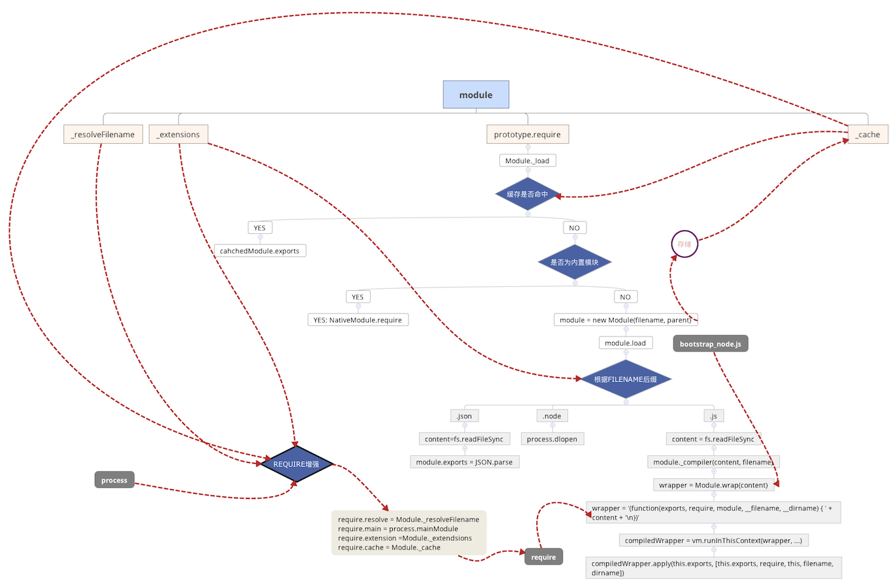

## 思维导图说明node功能实现 

### 1.node启动策略

### 2.模块加载策略

涉及的模块有[module.js](https://github.com/nodejs/node/blob/master/lib/module.js)、[bootstrap-node.js](https://github.com/nodejs/node/blob/master/lib/internal/bootstrap_node.js)、[node.cc](https://github.com/nodejs/node/blob/master/src/node.cc)等

