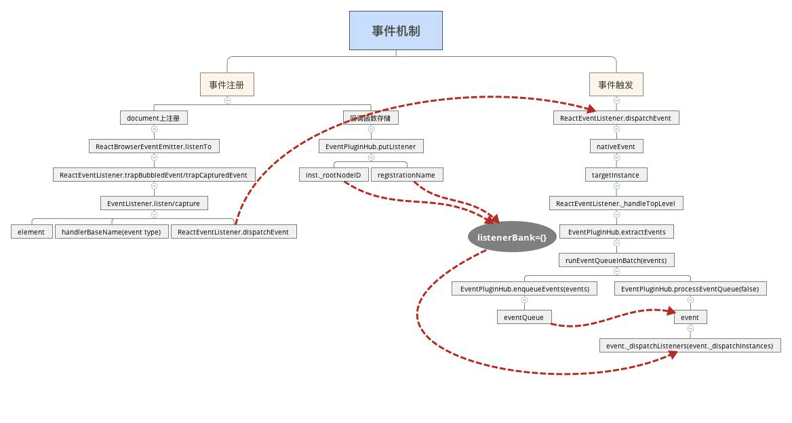

# React原理实现详解 -- 事件机制


## 对象池的管理

react中存在[PooledClass.js](https://github.com/facebook/react/blob/master/src/shared/utils/PooledClass.js)，这样可以对实例化的对象进行管理，避免创建过多的对象，进而造成内存压力。

## react事件系统

react在事件处理上具有如下优点:

- 几乎所有的事件代理(delegate)到`document`，达到性能优化的目的
- 对于每种类型的事件，拥有统一的分发函数`dispatchEvent`
- 事件对象(event)是合成对象(SyntheticEvent)，不是原生的



react内部事件系统实现可以分为两个阶段: 事件注册、事件触发。

### 事件注册

`ReactDOMComponent`(https://github.com/facebook/react/blob/master/src/renderers/dom/stack/client/ReactDOMComponent.js)在进行组件加载(mountComponent)、更新(updateComponent)的时候，需要对`props`进行处理(_updateDOMProperties):

```
ReactDOMComponent.Mixin = {
  _updateDOMProperties: function (lastProps, nextProps, transaction) {
    ...
    for (propKey in nextProps) {
      // 判断是否为事件属性
      if (registrationNameModules.hasOwnProperty(propKey)) {
        enqueuePutListener(this, propKey, nextProp, transaction);
      }
    }
  }
}
function enqueuePutListener(inst, registrationName, listener, transaction) {
  ...
  var doc = isDocumentFragment ? containerInfo._node : containerInfo._ownerDocument;
  listenTo(registrationName, doc);
  transaction.getReactMountReady().enqueue(putListener, {
    inst: inst,
    registrationName: registrationName,
    listener: listener
  });
  function putListener() {
    var listenerToPut = this;
    EventPluginHub.putListener(listenerToPut.inst, listenerToPut.registrationName, listenerToPut.listener);
  }
}
```

代码解析:

- 在props渲染的时候，如何属性是事件属性，则会用`enqueuePutListener`进行事件注册
- 上述`transaction`是ReactUpdates.ReactReconcileTransaction的实例化对象
- enqueuePutListener进行两件事情: 在`document`上注册相关的事件；对事件进行存储

#### document上事件注册

document的事件注册入口位于`ReactBrowserEventEmitter`:

```
// ReactBrowserEventEmitter.js
listenTo: function (registrationName, contentDocumentHandle) {
  ...
  if (...) {
    ReactBrowserEventEmitter.ReactEventListener.trapBubbledEvent(...);
  } else if (...) {
    ReactBrowserEventEmitter.ReactEventListener.trapCapturedEvent(...);
  }
  ...
}

// ReactEventListener.js
var ReactEventListener = {
  ...
  trapBubbledEvent: function (topLevelType, handlerBaseName, element) {
    ...
    var handler = ReactEventListener.dispatchEvent.bind(null, topLevelType);
    return EventListener.listen(element, handlerBaseName, handler);
  },
  trapCapturedEvent: function (topLevelType, handlerBaseName, element) {
    var handler = ReactEventListener.dispatchEvent.bind(null, topLevelType);
    return EventListener.capture(element, handlerBaseName, handler);
  }
  dispatchEvent: function (topLevelType, nativeEvent) {
    ...
    ReactUpdates.batchedUpdates(handleTopLevelImpl, bookKeeping);
    ...
  }
}
function handleTopLevelImpl(bookKeeping) {
  ...
  ReactEventListener._handleTopLevel(bookKeeping.topLevelType, targetInst, bookKeeping.nativeEvent, getEventTarget(bookKeeping.nativeEvent));
  ...
}
```

代码解析:
- 事件的注册、触发，具体是在`ReactEventListener`中实现的
- 事件的注册有两个方法: 支持冒泡(trapBubbledEvent)、trapCapturedEvent
- document不管注册的是什么事件，具有统一的回调函数`handleTopLevelImpl`
- document的回调函数中不包含任何的事物处理，只起到事件分发的作用

