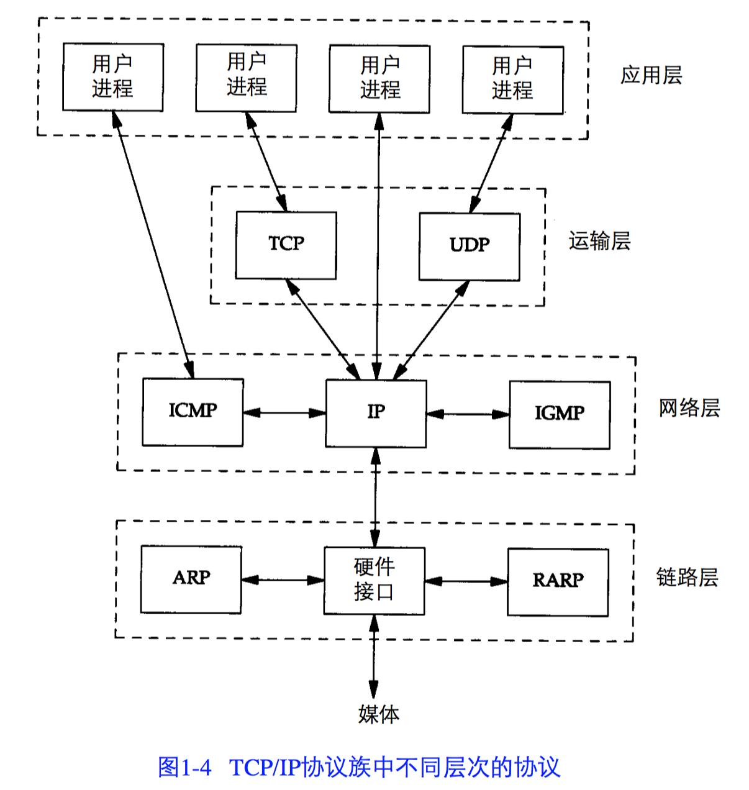
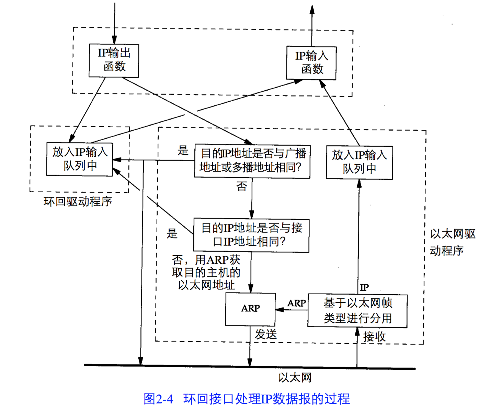
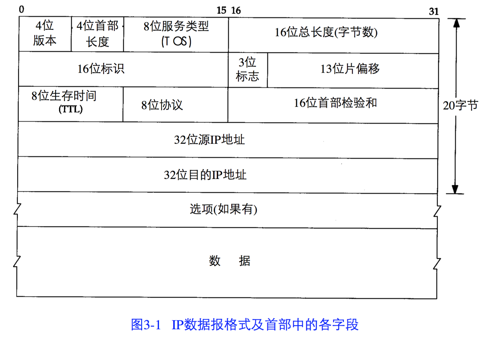

## TCP/IP协议详解

### 第一章 概述

- 路由器具有两个或多个接口，把分组从一个接口传送到另外一个接口
- 网桥是在链路层上对网络进行连接
- tcp/ip协议族的协议

- ICMP: 是IP协议的附属协议，实现主机与其他主机或路由器交换错误报文和其他重要信息，ping、traceroute均使用该协议
- 多接口主机或路由器具有多个IP地址
- 数据帧的长度为46~1500字节之间
- ICMP、IGMP报文都被封装在IP数据报中

### 第二章 链路层

- 是主要的局域网技术，采用CSMA/CD(带冲突检测的载波监听多路接入技术)
- 存在的协议：以太网、SLIP(串行IP)协议、PPP协议
- 以太网：数据的长度在46~1500字节
- SLIP: 一种简单的协议，存在一些问题，用于低速链路
- PPP协议: 在单根串行线路上运行多种协议，不只是IP协议；进行CRC(循环冗余校验)。用于低速链路
- 环回接口(LoopBack interface): 在一台主机上进行TCP/IP通信

- 最大传输单元(MTU): 为了提供足够快的响应时间；因为MTU，所以IP层需要进行进行分组

### 第三章 IP: 网络协议

- 路由选址都是相互独立的，所以顺序可能存在不一致的情况
- IP数据报的格式及头部各个字段

- TTL(time to live): 设置数据报可以经过最多的路由器数量，当数值减为0时，数据报就被丢弃，并发送ICMP报文通知主机
- IP可以从TCP、UDP、ICPM、IGMP接受数据报，并进行发送
- IP层在内存中存在一个路由表
- 为一个网络指定一个路由器，而不是为每一个主机指定一个路由器 
- IP寻址：首先根据IP地址或网络地址，进行路由寻址，找不到，只能使用默认的表目
- 每个链路层可能具有不同的数据帧首部，而链路层的目的地址始终指的是下一站的链路层地址
- 子网对外部路由器来说，隐藏了内部网络组织的细节，子网的划分减少了路由表的规模
- 
 

