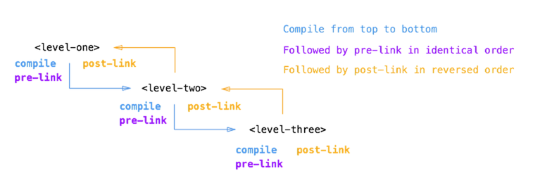

# {{page.title}}

## 1.双向数据绑定

目前业内盛行各种MV**框架，相关的框架不断涌现，而angular就是其中的一种(MVVM)。MV**框架其实最核心的问题就是将view层和model分离开来，降低代码的耦合性，做到数据和表现的分离，MVC、MVP、MVVM均有相同的目标，而他们之间的不同就在于如何把model层和view关联起来。

数据在model、view层如何流动就成了问题的关键，angular通过dirty-check实现了数据的双向绑定。所谓的双向绑定，就是view的变化可以反映到model层，而model数据的变化可以在view体现出来。那么angular是如何做到双向绑定的?为何成为dirty-check呢？还是前端的一个原始问题出发吧：


html:
<input type="button" value="increase 1" id="J-increase" />
;

js:
    var bindDate = {
        count: 1,
        appy: function () {
            document.querySelector('#J-count').innerHTML = this.count;
        },
        increase: function () {
            var _this = this;
            document.querySelector('#J-increase').addEventListener('click', function () {
                _this.count++;
                appy();
            }, true);
        },
        initialize: function () {
            // 初始化
            this.appy();
            //
            this.increase();
        }
    };
    bindDate.initialize();


在上面的例子中，存在两个过程:

- view层影响model层: 页面上点击button，造成数据count的数量增加1
- model层反应view层: count发生完变化以后，通过apply函数来反映到view层上

这是以前使用jquery、YUI等类库实现的数据处理，这里面存在的问题很明显:

- 涉及到了大量的DOM操作
- 过程繁琐
- 代码耦合性太高，不便于写单元测试。下面来看看angular是如何进行数据处理的：

第一步. 添加watcher：就是当数据发生变化的时候，需要检测哪些对象，需要先进行注册


// 添加watcher
// 对angular里面的源码进行了精简
$watch: function(watchExp, listener, objectEquality) {
    var scope = this,
        array = scope.$$watchers,
        watcher = {
            fn: listener,
            last: initWatchVal,
            get: get,
            exp: watchExp,
            eq: !!objectEquality
        };
    if (!array) {
        array = scope.$$watchers = [];
    }
    array.unshift(watcher);
}

第二步. dirty-check：就是当有某个scope作用域下的数据发生变化后，需要遍历检测注册的$$watchers = [...]


// dirty-check
$digest: function() {
    while (length--) {
        watch = watchers[length];
        watch.fn(value, lastValue, scope);
    }
}


 这样就实现了数据的双向绑定，上面的实现是否跟自定义事件很像呢？可以看到使用了观察者设计模式或(publisher-subscriber)。

## 2.依赖注入

使用过spring框架的同学都知道，Ioc、AOP是spring里面最重要的两个概念，而Ioc就可以里面为注入依赖(DI)，很明显angular带有非常浓厚的后端色彩。

同样，首先来看下不使用DI，是如何解决对象相互依赖的:


// 传统对象依赖解决办法
function Car() {
    ...
}
Car.prototype = {
    run: function () {...}
}

function Benz() {
    var cat = new Car();
}
Benz.prototype = {
    ...
}

在上面的例子中，类Benz依赖于类Car，直接通过内部New来解决这种依赖关系。这样做的弊端非常明显，代码耦合性变高，不利于维护。后端框架很早就意识到了这个问题，spring早期通过在xml文件中注册对象之间的依赖关系，后来有通过anotation的方式更加方便地解决DI问题，COS端的同学可以看看后端的代码。

js语言本身是不具有注解(annotation)机制的，那angular是如何实现的呢？

**1.模拟注解**


// 注解模拟
// 注解的模拟
function annotate(fn, strictDi, name) {
    var $inject;
    if (!($inject = fn.$inject)) {
        $inject = [];
        $inject.push(name);
    }else if (isArray(fn)) {
        $inject = fn.slice(0, last);
    }
    return $inject;
}
createInjector.$$annotate = annotate;


**2. 注入对象的创建**


// 注入对象的创建
function createInjector(modulesToLoad, strictDi) {
    //通过singleton模式创建对象
    var providerCache = {
        $provide: {
            provider: supportObject(provider),
            factory: supportObject(factory),
            service: supportObject(service),
            value: supportObject(value),
            constant: supportObject(constant),
            decorator: decorator
          }
      },
    instanceCache = {},
    instanceInjector = (instanceCache.$injector =
        createInternalInjector(instanceCache, function(serviceName, caller) {
            var provider = providerInjector.get(serviceName + providerSuffix, caller);
            return instanceInjector.invoke(provider.$get, provider, undefined, serviceName);
        }));
    return instanceInjector;
}


**3. 获取注入对象**


// 对象获取，注解对象实际注入
function invoke(fn, self, locals, serviceName) {
    var args = [],
        $inject = annotate(fn, strictDi, serviceName);

    for (...) {
        key = $inject[i];
        // 替换成依赖的对象
        args.push(
          locals && locals.hasOwnProperty(key)
          ? locals[key]
          : getService(key, serviceName)
        );
    }
    if (isArray(fn)) {
        fn = fn[length];
    }
    return fn.apply(self, args);
}


到这里，是否是看到很多后端框架设计的思路，没有anotation就模拟一个，难怪PPK要说angular是" a front-end framework by non-front-enders for non-front-enders"

### 3.controller通信

在实际开发中，应用系统会非常庞大，一个应用app不可能只存在一个controller，那么不同controller之间就存在通信的可能，如何解决这个常见问题，主要有两种方法：

**1.事件机制:** 把事件注册在$rootScope上，这样做的问题就是会在$rootScope上注册太大事件，会引起一些列后续问题


// 事件解决controller通信
//controller1
app.controller('controller1', function ($rootScope) {
    $rootScope.$on('eventType', function (arg) {
        ......
    })
})

// controller2
app.controller('controller2', function ($rootScope) {
    $rootScope.$emit('eventType',arg);
    or
    $rootScope.$broadcast('eventType',arg);
})


**2.通过service:** 充分利用angular的DI特性，利用service是单例的特点，在不同controller之间起到桥梁作用


// service解决controller通信
// 注册service
app.service('Message', function () {
    return {
        count: void(0);
    }
})

// controller1,修改service的count值
app.controller('controller1', function ($scope, Message) {
    $scope.count = 1;
    Message.count = $scope.count;
});

// controller2, 获取service的count值
app.controller('controller2', function ($scope, Message) {
    $scope.num = Message.count;
});


### 4.service的特点

**1.单例(singleton):** angular里面只有service才可以进行DI诸如，controller、directive这些均不具有这些功能，service字面上就是提供一些基本的服务，跟具体的业务没有关联，而controller、directive则与具体业务紧密相关联，所以需要保证service的唯一性。

**2.lazy new:** angular首先会生成service的provider，但是并没有立即生成对应的service，只有到需要这些服务的时候才会进行实例化操作。

**3.provider的分类:** provider()、factory、service、value、constant，其中provider是最底层的实现，其他方式都是在其基础上的语法糖(sugar)，需要注意的是这些服务最终均要添加$get方法，因为具体service是通过执行$get方法生成的。

### 5.directive的实现

directive的编译(compiler)包括两个阶段: compile、link。简单来讲compile阶段主要处理template DOM，此时并不涉及作用域问题，也就是没有进行数据渲染，例如ngRepeate指令就是通过compile进行template修改的，执行compile后会返回link函数，覆盖后面定义的link函数；而link主要是进行数据渲染，分为pre-link和post-link两个环节，这两个环节解析的顺序是相反，post-link是先解析内部，然后才是外部，这样对directive的解析就是安全的，因为directive内部还可以包括directive，同时link是对真正DOM的处理，会涉及DOM操作的性能问题。

### 参考

[https://angularjs.org/](https://angularjs.org/)
[https://github.com/xufei/blog/issues/10](https://github.com/xufei/blog/issues/10)
[http://teropa.info/blog/2013/11/03/make-your-own-angular-part-1-scopes-and-digest.html](http://teropa.info/blog/2013/11/03/make-your-own-angular-part-1-scopes-and-digest.html)
[http://www.quirksmode.org/blog/archives/2015/01/the_problem_wit.html](http://www.quirksmode.org/blog/archives/2015/01/the_problem_wit.html)
[http://www.jvandemo.com/the-nitty-gritty-of-compile-and-link-functions-inside-angularjs-directives/](http://www.jvandemo.com/the-nitty-gritty-of-compile-and-link-functions-inside-angularjs-directives/)

