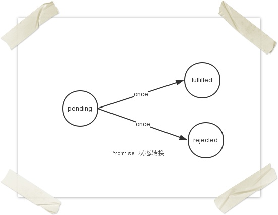
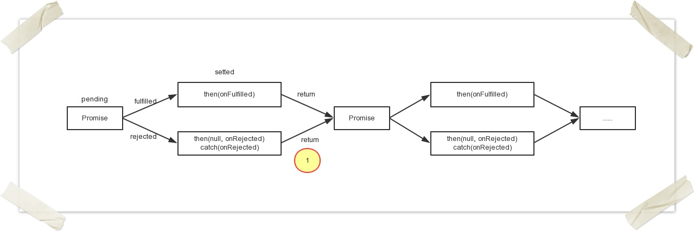
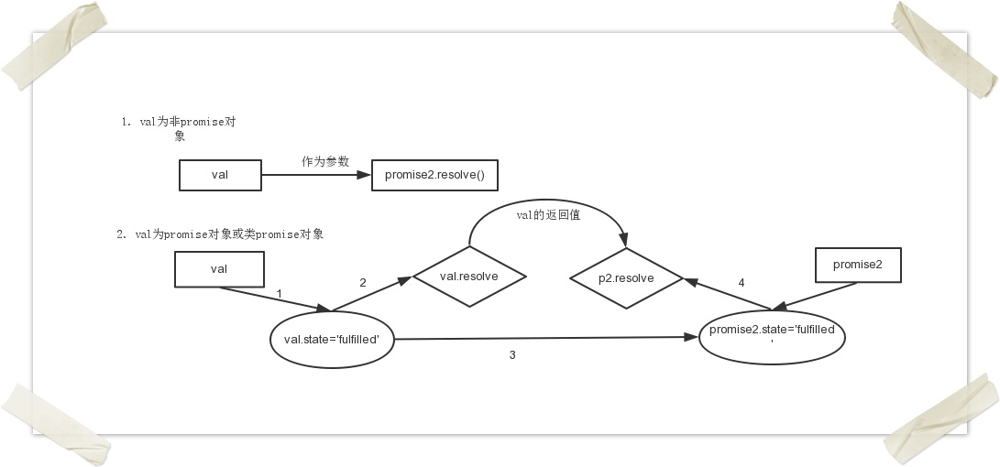

# promise

目前需求中涉及到大量的异步操作，实际的页面越来越倾向于单页面应用。以后可能会使用backbone、angular、knockout等框架，但是关于异步编程的问题是首先需要面对的问题。随着node的兴起，异步编程变得更加常见。经过一段时间的学习和实践，对异步编程的一些细节进行总结。

## 1.异步编程的分类

解决异步问题的方法大致包括：直接回调、pub/sub模式(事件模式)、异步库控制库(例如async、when)、promise、Generator等。

### 1.1 回调函数
回调函数是常用的解决异步的方法，经常接触和使用到，易于理解，并且在库或函数中非常容易实现。这种也是大家接使用异步编程经常使用到的方法。

但是回调函数的方式存在如下的问题：

- 可能形成万恶的嵌套金字塔，代码不易阅读；
- 只能对应一个回调函数，在很多场景中成为一个限制。

### 1.2 pub/sub模式(事件)

该模式也称为事件模式，是回调函数的事件化，在jQuery等类库中非常常见。

事件发布订阅者模式本身并无同步与异步调用的问题，但是在node中，emit调用多半是伴随事件循环而异步触发的。该模式常用来解耦业务逻辑，事件发布者无须关注注册的回调函数，也不用关注回调函数的个数，数据通过消息的方式可以很灵活的传递。

该模式的好处是：1. 便于理解；2. 不再局限于一个回调函数。

不好的地方时：1. 需要借助类库； 2.事件与回调函数的顺序很重要。

    var img = document.querySelect(#id);
    img.addEventListener('load', function() {
    	// 图片加载完成
        ......
    });
    img.addEventListener('error', function() {
    	// 出问题了
    	......
    });

上述代码存在两个问题：

**a)** img实际已经加载完成，此时才绑定load回调函数，结果回调不会执行，但依然希望执行该对应回调函数。

    var img = document.querySelect(#id);
    function load() {
    	...
    }

    if(img.complete) {
    	load();
    } else {
    	img.addEventListener('load', load);
    }

    img.addEventListener('error', function() {
    	// 出问题了
    	......
    });

**b)** 无法很好处理存在异常

结论：事件机制最适合处理同一个对象上反复发生的事情，不需要考虑当绑定回调函数之前事件发生的情况。

### 1.3 异步控制库

目前的异步库主要有Q、when.js、win.js、RSVP.js等。这些库的特点是代码是线性的，可以从上到下完成书写，符合自然习惯。不好的地方也是风格各异，不便于阅读，增加学习成本。

### 1.4 Promise

Promise翻译成中文为承诺，个人理解是异步完成之后，就会给外部一个结果（成功或失败），并承诺结果不再发生改变。换句话就是Promise反应了一个操作的最终返回结果值(A promise represents the eventual value returned from the single completion of an operation)。目前Promise已经引入到ES6规范里面，Chrome、firefox等高级浏览器已经在内部实现了该原生方法，使用起来相当方便。

下面从如下几个方面来解析Promise的特点：

#### 1.4.1 状态
包含三种状态：pending、fulfilled、rejected，三种状态只能发生两种转换(从pending--->fulfilled、pending—>rejected)，并且状态的转换仅能发生一次。

#### 1.4.2 then方法

then方法用于指定异步事件完成之后的回调函数。这个方法可以说是Promise的灵魂方法，该方法让Promise充满了魔力。有如下几个具体表现：

**a)** then方法返回Promise。这样就实现了多个异步操作的串行操作。

关于上图中黄圈1的对value的处理是Promise里面较为复杂的一个地方，value的处理分为两种情况：Promise对象、非Promise对象。

当value 不是Promise类型时，直接将value作为第二个Promise的resolve的参数值即可；当为Promise类型时，promise2的状态、参数完全由value决定，可以认为promsie2完全是value的傀儡，promise2仅仅是连接不同异步的桥梁。

    Promise.prototype.then = function(onFulfilled, onRejected) {
    	return new Promise(function(resolve, reject) {           //此处的Promise标注为promise2
    		handle({
    			onFulfilled: onFulfilled,
    			onRejected: onRejected,
    			resolve: resolve,
    			reject: reject
    		})
    	});
    }

    function handle(deferred) {
    	var handleFn;
    	if(state === 'fulfilled') {
    		handleFn = deferred.onFulfilled;
    	} else if(state === 'rejected') {
    		handleFn = deferred.onRejected;
    	}
    	var ret = handleFn(value);
    	deferred.resolve(ret);                           //注意，此时的resolve是promise2的resolve
    }
    function  resolve(val) {
    	if(val && typeof val.then === 'function') {
    		val.then(resolve);                           // if val为promise对象或类promise对象时，promise2的状态完全由val决定
    		return;
    	}
    	if(callback) {                                    // callback为指定的回调函数
    		callback(val);
    	}
    }

**b)** 实现了多个不同异步库之间的转换。

在异步中存在一个叫thenable的对象，就是指具有then方法的对象，只要一个对象对象具有then方法，就可以对其进行转换，例如：

    var deferred = $('aa.ajax');      // !!deferred.then  === true
    var P = Promise.resolve(deferred);
    p.then(......)

#### 1.4.3 Promise/A、Promise/A++规范

目前关于Promise的规范存在Promise/A和Promise/A+规范，这说明关于Promise的实现是挺复杂的。

    then(fulfilledHandler, rejectedHandler, progressHandler)

    then(onFulfilled, onRejected）

两个的规范的区别在于以下几点：

- promise/A规范定义可以选择性支持progressHandler
- Promise/A++规范更加详细：定义了很多术语(如thenable、value、reason)，onFufilled、onRejected必须为函数。

#### 1.4.4 注意事项

一个Promise里面的回调函数是共享value的，在结果处理中value作为参数传递给相应的回调函数，如果value是对象，那就要小心不要轻易修改value的值。

    var p = Promise.resolve({x: 1});
    p.then(function(val) {
        console.log('first callback: ' + val.x++);
    });
    p.then(function(val) {
        console.log('second callback: ' + val.x)
    })
    // first callback: 1
    // second callback: 2

### 1.5 Generator

上面所有的方法均是基于回调函数来完成异步操作的，无非是对回调函数进行封装而已。ES6里面提出了Generator，增加了解决异步操作的途径，不再依据回调函数来完成。

Generator最大的特点就是可以实现函数的暂停、重启，这个特性非常有利于解决异步操作。将Generator的暂停与promise的异常处理结合起来，可以比较优雅地解决异步编程问题。具体实现参考：[Kyle Simpson](http://davidwalsh.name/es6-generators)

## 2. 异步编程存在的问题

### 2.1 异常处理

**a)** 异步事件包括两个环节：发出异步请求、结果处理，这两个环节通过event loop来连接起来。那么try catch来进行异常捕获的时候就需要分来捕获。

    try {
    	asyncEvent(callback);
    } catch(err) {
    	......
    }

上述代码是无法捕获callback里面的异常，只能获取发出请求环节的异常。这样就存在问题：假如请求的发出和请求的处理是两个人完成的，那么在异常处理的时候就存在问题？

**b)** promise实现异常的传递，这带来一些好处，在实际项目中保证代码不被阻塞。但是如果异步事件比较多的时候，不容易找出到底是那个异步事件产生了异常。


// 场景描述： 在CRM里面展示价格的报警信息，其中包含竞对的信息。但是获取竞对的信息时间比较长，后端为了避免慢查询，就把一条记录拆成两块分别获取。
// 第一步：获取价格报警信息，除了竞对信息
function getPriceAlarmData() {
    return new Promise(function(resolve) {
        Y.io(url, {
            method: 'get',
            data: params,
            on: function() {
                success: function(id, data) {
                    resolve(alarmData);
                }
            }
        });
    });
}
// 得到报警信息后，在去获取竞对信息
getPriceAlarmData().then(function(data) {
    // 数据渲染，除了竞对信息
    render(data);
    return new Promise(function(resolve) {
        Y.io(url, {
            method: 'get',
            data: {alarmList: data},
            on: function() {
                success: function(id, compData) {
                    resolve(compData);
                }
            }
        });
    });
})      //  获取完所有数据后进行竞对信息的渲染
.then(function(data) {
    // 渲染竞对信息
    render(data)
}, function(err) {
    // 异常处理
    console.log(err);
});


可以把上述代码转换成如下：

    try{
    	// 获取除竞对以外的报警信息
    	var alarmData = alarmDataExceptCompare();
    	render(alarmData);
        // 根据报警信息查询竞对信息
        var compareData = getCompareInfo(alarmData);
    	render(compareData);
    } catche(err) {
    	console.log(err.message);
    }

在上述例子中把异常处理放到最后进行处理，这样当其中存在某个环节出现异常，我们无法准确知道到底是哪个事件产生的。

### 2.2 jQuery.Deferred 的问题

jQuery中也实现了异步操作，但是在实现上不符合promise/A+规范，主要表现在以下几个方面：

**a)** 参数的个数：标准的Promise只能接受一个参数，而jQuery中则可以传递多个参数

    function asyncInJQuery() {
     	var d = new $.Deferred();
        setTimeout(function() {
         	d.resolve(1, 2);
        }, 100);
        return d.promise()
    }
    asyncInJQuery().then(function(val1, val2) {
        console.log('output: ', val1, val2);
    });
    // output: 1 2

**b)** 结果处理中异常的处理


function asyncInPromise() {
      return new Promise(function(resolve) {
        setTimeout(function() {
          var jsonStr = '{"name": "mt}';
          resolve(jsonStr);
        }, 100);
      });
  }
  asyncInPromise().then(function(val) {
      var d = JSON.parse(val);
      console.log(d.name);
  }).then(null, function(err) {
    console.log('show error: ' + err.message);
  });
// show error: Unexpected end of input

function asyncInJQuery() {
    var d = new $.Deferred();
    setTimeout(function() {
        var jsonStr = '{"name": "mt}';
        d.resolve(jsonStr);
    }, 100);
    return d.promise()
}
asyncInJQuery().then(function(val) {
    var d = JSON.parse(val);
    console.log(d.name);
}).then(function(v) {
    console.log('success: ', v.name);
}, function(err){
    console.log('show error: ' + err.message);
});

//Uncaught SyntaxError: Unexpected end of input


从中可以看出，Promise对回调函数进行了结果处理，可以捕获回调函数执行过程中的异常，而jQuery.Deferred却不可以。

## 3. 参考内容

[http://sporto.github.io/blog/2012/12/09/callbacks-listeners-promises/](http://sporto.github.io/blog/2012/12/09/callbacks-listeners-promises/)

[https://developer.mozilla.org/en-US/docs/Web/JavaScript/Reference/Global_Objects/Promise](https://developer.mozilla.org/en-US/docs/Web/JavaScript/Reference/Global_Objects/Promise)

[http://wiki.commonjs.org/wiki/Promises/A#Open_Issues](http://wiki.commonjs.org/wiki/Promises/A#Open_Issues)

[https://promisesaplus.com/](https://promisesaplus.com/)

[https://blog.domenic.me/youre-missing-the-point-of-promises/](https://blog.domenic.me/youre-missing-the-point-of-promises/)

[http://www.html5rocks.com/zh/tutorials/es6/promises/](http://www.html5rocks.com/zh/tutorials/es6/promises/)

[http://davidwalsh.name/es6-generators](http://davidwalsh.name/es6-generators)
