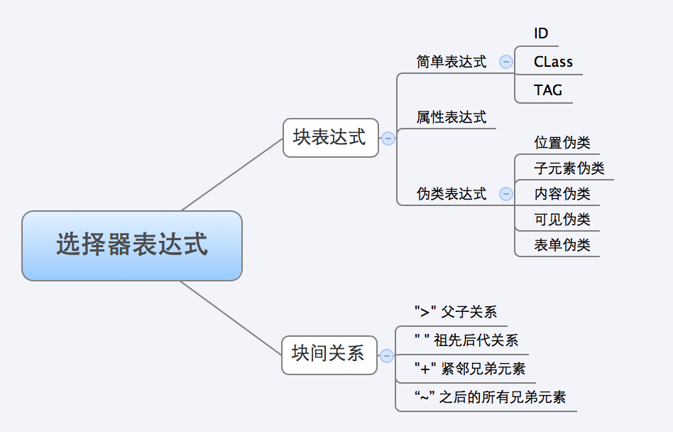
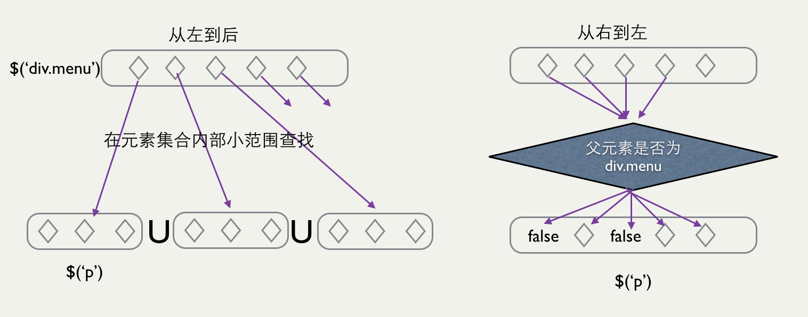
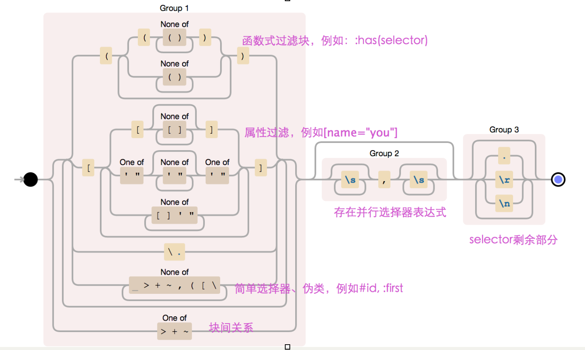
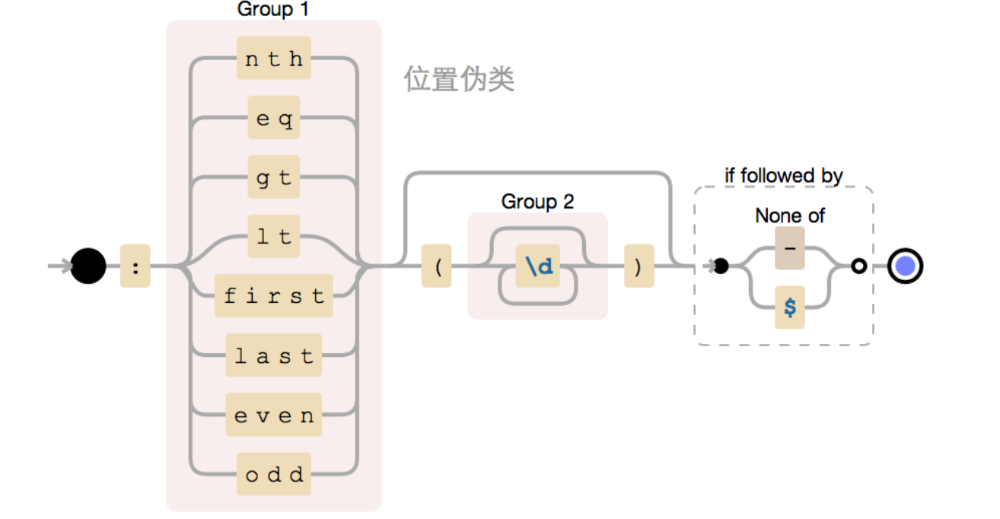
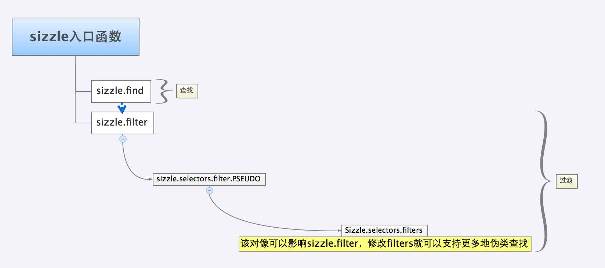

# Sizzle选择器引擎介绍

## 一、前言

Sizzle原来是jQuery里面的选择器引擎，后来逐渐独立出来，成为一个独立的模块，可以自由地引入到其他类库中。我曾经将其作为YUI3里面的一个module，用起来畅通无阻，没有任何障碍。Sizzle发展到现在，以jQuery1.8为分水岭，大体上可以分为两个阶段，后面的版本中引入了编译函数的概念，Sizzle的源码变得更加难读、不再兼容低版本浏览器，而且看起来更加零散。本次阅读的是Sizzle第一个阶段的最终版本jQuery1.7，从中收获颇多，一方面是框架设计的思路，另外一方面是编程的技巧。

## 二、jQuery constructor

Sizzle来源于jQuery，并且jQuery是一个基于DOM操作的类库，那么在研究Sizzle之前很有必要看看jQuery的整体结构：


(function(window, undefined) {
    var jQuery = function (selector, context) {
        return new  jQuery.fn.init(selector, context, rootjQuery);
    }
    jQuery.fn = jQuery.prototype = {...}
    jQuery.fn.init.prototype = jQuery.fn;
    // utilities method
    // Deferred
    // support
    // Data cache
    // queue
    // Attribute
    // Event
    // Sizzle about 2k lines
    // DOM
    // css operation
    // Ajax
    // animation
    // position account
    window.jQuery  = window.$ = jQuery;
})


jQuery具有很强的工程性，一个接口可以处理多种输入，是jQuery容易上手的主要原因，相应的，这样一个功能庞大的API内部实现也是相当复杂。要想弄清楚jQuery与Sizzle之间的关系，首先就必须从jQuery的构造函数入手。经过整理，理清楚了构造函数的处理逻辑，在下面的表中，jQuery的构造函数要处理6大类情况，但是只有在处理选择器表达式(selector expression)时才会调用Sizzle选择器引擎。

## 三、Sizzle的设计思路

对于一个复杂的选择器表达式(下文的讨论前提是浏览器不支持querySelectorAll) ，如何对其进行处理？

### 3.1 分割解析

对于复杂的选择器表达式，原生的API无法直接对其进行解析，但是却可以对其中的某些单元进行操作，那么很自然就可以采取先局部后整体的策略：把复杂的选择器表达式拆分成一个个块表达式和块间关系。在下图中可以看到，1、选择器表达式是依据块间关系进行分割拆分的；2、块表达式里面有很多伪类表达式，这是Sizzle的一大亮点，而且还可以对伪类进行自定义，表现出很强的工程性；3、拆分后的块表达式有可能是简单选择器、属性选择器、伪类表达式的组合，例如div.a、.a[name = "beijing"]。

### 3.2  块表达式查找

经过块内查找， 得到了一个基本的元素集合，那如何处理块间关系呢？通过观察可以发现，对一个复杂的选择器表达式存在两种顺序：

- 从左到右：对得到的集合，进行内部逐个遍历，得到新的元素集合，只要还有剩余的代码块，就需要不断地重复查找、过滤的操作。总结下就是：多次查找、过滤。

- 从右到左：对得到的元素集合，肯定包括了最终的元素，而且还有多余的、不符合条件的元素，那么接下来的工作就是不断过滤，把不符合条件的元素剔除掉。

对于“相邻的兄弟关系(+)”、“之后的兄弟关系(~)”,哪种方式都无所谓了，效率没什么区别。但是对于“父子关系”、“祖先后代关系”就不一样了，此时Sizzle选择的是以从右到左为主，下面从两个维度进行解释：

**a、设计思路**

- 左到右：不断查询，不断缩小上下文，不断地得到新的元素集合
- 右到左：一次查询，多次过滤，第一查找得到的元素集合不断缩小，知道得到最终的集合

**b、DOM树**

- 左到右：从DOM的上层往底层进行的，需要不断遍历子元素或后代元素，而一个元素节点的子元素或后代元素的个数是未知的或数量较多的
-右到左：从DOM的底层往上层进行的，需要不断遍历父元素或祖先元素，而一个元素的父元素或者祖先元素的数量是固定的或者有限的

但是从右到左是违背我们的习惯的，这样做到底会不会出现问题呢？答案是会出现错误，请看下面的一个简单DOM树：

> &lt;div&gt; 
    &lt;p&gt;aa &lt;/p&gt;
&lt;/div&gt; 
> &lt;div class=“content”&gt; 
    &lt;p&gt;bb&lt;/p&gt; 
    &lt;p&gt;cc&lt;/p&gt; 
&lt;/div&gt;

求$(‘.content > p:first’)的元素集合?

 首先进行分割： ‘.content > p:first’---> ['.content', '>', 'p:first']

 右-->左

 - 查找： A = $('p:first') = ['&lt;p&gt;aa&lt;/p&gt;']
 - 过滤： A.parent().isContainClass('content')---> null

在上面的例子中，我们看到当选择器表达式中存在位置伪类的时候，就会出现错误，这种情况下没有办法，准确是第一位，只能选择从左到右。

**结论： 从性能触发，采取从右到左； 为了准确性，对位置伪类，只能采取从左到右。**

## 四、Sizzle具体实现

### 4.1 Sizzle整体结构

    if(document.querySelectorAll) {
        sizzle = function(query, context) {
            return makeArray(context.querySelectorAll(query));
         }
    } else {
        sizzle 引擎实现，主要模拟querySelectorAll
    }

通过上述代码可以看到，Sizzle选择器引擎的主要工作就是向上兼容querySelectorAll这个API，假如所有浏览器都支持该API，那Sizzle就没有存在的必要性了。

关键函数介绍：

- Sizzle = function(selector, context, result, seed) : Sizzle引擎的入口函数
- Sizzle.find: 主查找函数
- Sizzle.filter: 主过滤函数
- Sizzle.selectors.relative: 块间关系处理函数集   {“+”: function() {}, “ ”:function() {}, “>”: function() {}, “~”: function() {}}

### 4.2 分割解析

    chunker = /((?:\((?:\([^()]+\)|[^()]+)+\)|\[(?:\[[^\[\]]*\]|['"][^'"]*['"]|[^\[\]'"]+)+\]|\\.|[^ >+~,(\[\\]+)+|[>+~])(\s*,\s*)?((?:.|\r|\n)*)/g

就是靠这样一个正则表达式，就可以把复杂多样的选择器表达式分割成若干个块表达式和块间关系，是不是觉得块表达式是一项神奇的技术，可以把复杂问题抽象化。正则的缺点是不利于阅读和维护，下图对其进行图形分析：

再来看看是如何具体实现的呢：


do {
        chunker.exec( "" ); // chunker.lastIndex = 0
        m = chunker.exec( soFar );
        if ( m ) {
            soFar = m[3];
            parts.push( m[1] );
            if ( m[2] ) {
                extra = m[3];
                break;
            }
        }
    } while ( m );

for example：
$(‘#J-con  ul>li:gt(2)’) 解析后的结果为：
parts = ["#J-con", "ul", ">", “li:gt(2)"]
extra = undefined

$(‘#J-con  ul>li:gt(2), div.menu’) 解析后的结果为：
parts = ["#J-con", "ul", ">", “li:gt(2)"]
extra = ‘div.menu’


### 4.3 块表达式处理

#### 4.3.1 块内查找

在查找环节，通过Sizzle.find来实现，主要逻辑如下：

- 依据DOM API性能决定查找依据： ID > Class> Name> Tag, 其中要考虑浏览器是否支持getElementsByClassName
- Expr.leftMatch：确定块表达式类型
- Expr.find：具体的查找实现
- 结果： {set: 结果集合, expr: 块表达式剩余的部分，用于下一步的块内过滤}


// Expr.order = [“ID”, [ “CLASS”], “NAME”, “TAG ]
for ( i = 0, len = Expr.order.length; i < len; i++ ) {
    ……
    if ( (match = Expr.leftMatch[ type ].exec( expr )) ) {
        set = Expr.find[ type ]( match, context);
        expr = expr.replace( Expr.match[ type ], "" );
    }
}


#### 4.3.2块内过滤

该过程通过Sizzle.filter来进行，该API不仅可以进行块内过滤，还可以进行块间过滤，通过inplace参数来确定。主要逻辑如下：

- Expr.filter： {PSEUDO, CHILD, ID, TAG, CLASS, ATTR, POS} ， 选则器表达式的类型
- Expr.preFilter： 过滤前预处理，保证格式的规范化
- Expr.filter： 过滤的具体实现对象
- 内过滤、块间从左到后: inplace=false,返回新对象；块间从右到左: inplace=true, 原来的元素集合上过滤


Sizzle.filter = function( expr, set, inplace, not ) {
    for ( type in Expr.filter ) { //filter： {PSEUDO, CHILD, ID, TAG, CLASS, ATTR, POS}
        //   Expr.leftMatch：确定selector的类型
        if ( (match = Expr.leftMatch[ type ].exec( expr )) != null && match[2] ) {
            // 过滤前预处理，保证格式的规范化
            match = Expr.preFilter[ type ]( match, curLoop, inplace, result, not, isXMLFilter );
            // 进行过滤操作
            found = Expr.filter[ type ]( item, match, i, curLoop );
            // if inplace== true,得到新数组对象；
            if ( inplace && found != null ) {
                if ( pass ) { anyFound = true; } else { curLoop[i] = false; }
            } else if ( pass ) {
                result.push( item );
            }
        }
    }
}


### 4.4 块间关系处理

#### 4.4.1 判断处理顺序

满足下面的正则，说明存在位置伪类，为了保证计算的准确定，必须采取从左到后的处理顺序，否则可以为了效率尽情使用从右到左。

    origPOS = /:(nth|eq|gt|lt|first|last|even|odd)(?:\((\d*)\))?(?=[^\-]|$)/

#### 4.4.2 左到右处理

首先依据parts的第一个元素进行查询，然后对得到的元素集合进行遍历，利用位置伪类处理函数posProcess进行伪类处理，直到数组parts为空。

    // parts是selector expression分割后的数组
    set = Expr.relative[ parts[0] ] ? [ context ] :   Sizzle( parts.shift(), context );
    // 对元素集合多次遍历，不断查找
    while(parts.length) {

        selector = parts.shift();
        ……
        set = posProcess(selector, set, seed);

    }

接下来在看下posProcess的内部逻辑：如果表达式内部存在位置伪类(例如p:first)，在DOM的API中不存在可以处理伪类（:first）的API，这种情况下就先把伪类剔除掉，依照剩余的部分进行查询(p)，这样得到一个没有伪类的元素集合，最后在以上述中的伪类为条件，对得到的元素集合进行过滤。


// 从左到后时，位置伪类处理方法
var posProcess = function( selector, context, seed ) {
	var match,
       tmpSet = [],
       later = "",
       root = context.nodeType ? [context] : context;
    // 先剔除位置伪类，保存在later里面
    while ( (match = Expr.match.PSEUDO.exec( selector )) ) {
    	later += match[0];
       selector = selector.replace( Expr.match.PSEUDO, "" );
    }

    selector = Expr.relative[selector] ? selector + "*" : selector;
    // 在不存在位置伪类的情况下，进行查找
    for ( var i = 0, l = root.length; i < l; i++ ) {
    	Sizzle( selector, root[i], tmpSet, seed );
    }
    // 以位置伪类为条件，对结果集合进行过滤
    return Sizzle.filter( later, tmpSet );
};


#### 4.4.3 右到左的处理顺序

其实Sizzle不完全是采用从右到左，如果选择器表达式的最左边存在#id选择器，就会首先对最左边进行查询，并将其作为下一步的执行上下文，最终达到缩小上下文的目的，考虑的相当全面。


// 如果selector expression 最左边是#ID，则计算出#ID选择器，缩小执行上下文
if(parts[0] is #id) {
    context = Sizzle.find(parts.shift(), context)[0];
}
if (context) {
    // 得到最后边块表达式的元素集合
    ret = Sizzle.find(parts.pop(), context);
    // 对于刚刚得到的元素集合，进行块内元素过滤
    set = Sizzle.filter(ret.expr, ret.set) ;
    // 不断过滤
    while(parts.length) {
        pop = parts.pop();
        ……
        Expr.relative[ cur ]( checkSet, pop );
    }
}


对于块间关系的过滤，主要依据Expr.relative来完成的。其处理逻辑关系是：判断此时的选择器表达式是否为tag，如果是则直接比较nodeName，效率大增，否则只能调用Sizzle.filter。下面以相邻的兄弟关系为例进行说明：


"+": function(checkSet, part){
    var isPartStr = typeof part === "string",
        isTag = isPartStr && !rNonWord.test( part ),   //判断过滤selector是否为标签选择器
        isPartStrNotTag = isPartStr && !isTag;
    if ( isTag ) {
        part = part.toLowerCase();
    }
    for ( var i = 0, l = checkSet.length, elem; i < l; i++ ) {
        if ( (elem = checkSet[i]) ) {
            while ( (elem = elem.previousSibling) && elem.nodeType !== 1 ) {}
            checkSet[i] = isPartStrNotTag || elem && elem.nodeName.toLowerCase() === part ?
                elem || false :
                elem === part;
        }
    }
    if ( isPartStrNotTag ) {
        Sizzle.filter( part, checkSet, true );
    }
}


## 4.5 拓展性

Sizzle的另外一大特性就是可以自定义选择器，当然仅限于伪类，这是Sizzle工程型很强的另外一种表现：

    $.extend($.selectors.filters, {
        hasLi: function( elem ) {
            return $(elem).find('li').size() > 0;
        }
    });
    var e = $('#J-con :hasLi');
    console.log(e.size());    // 1

上述代码中的$.extend相当远YUI3中的augment、extend、mix的合体，功能相当强大，只需要对$.selectors.filters(即Sizzle.selectors.filters)对象进行拓展就可以，里面每个属性的返回值为Boolean类型，用于判断伪类的类型。
