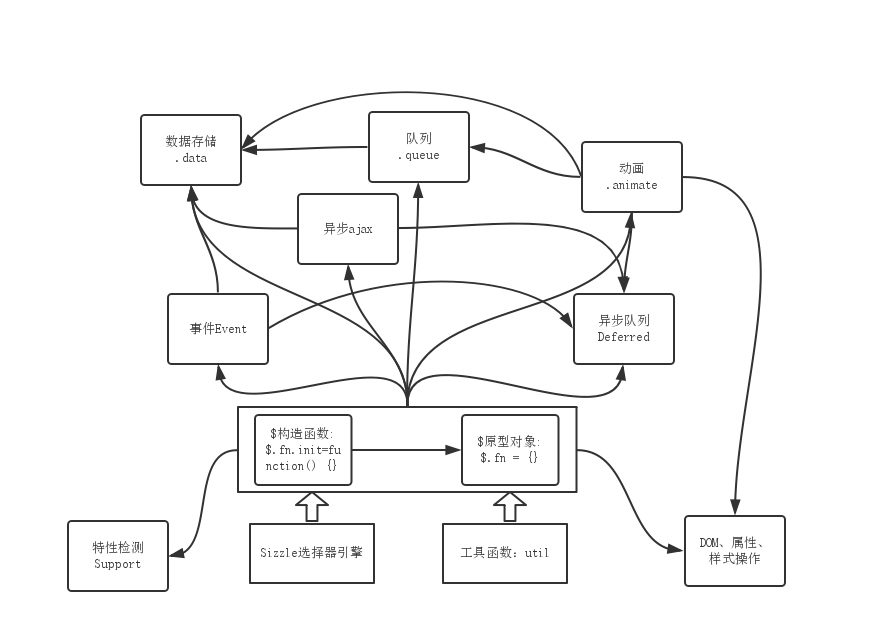
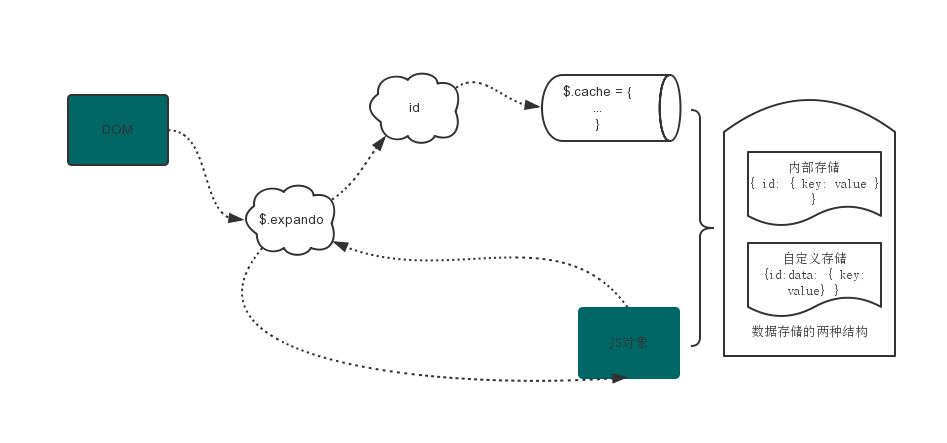
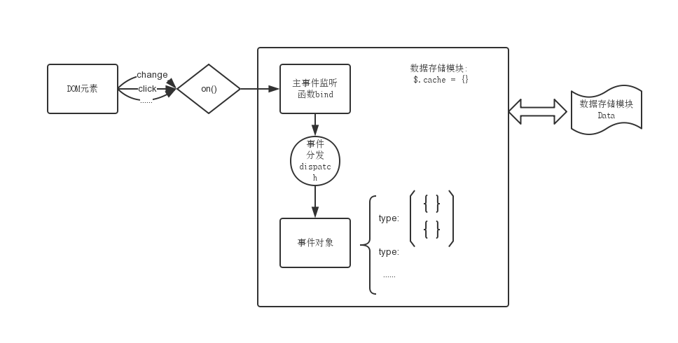
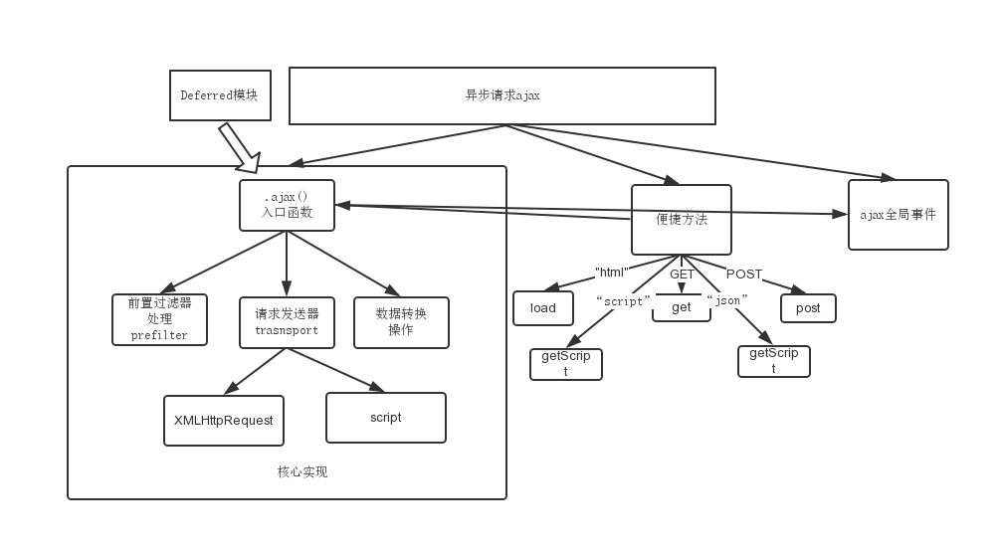
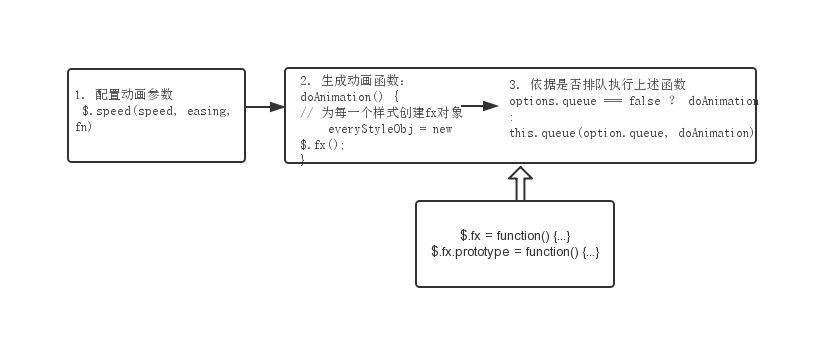

# jQuery类库的设计

## 1.总体设计

 本文对jquery1.7版本进行了阅读学习，将整个jquery源码拆分为11个模块，这些模块相互依赖，构成了一个简单、强大的js类库。jquery是一个基于DOM操作的类库，因此Sizzle选择器引擎的实现就显得尤为重要。针对[Sizzle选择器引擎的实现]，之前已经做过先关的分析。下面对其中的数据存储、事件处理、异常请求ajax、动画等进行简单的介绍。

    (function(window, undefined) {
        var jQuery = function(selector, context) {
            return new jQuery.fn.init(selector, context, rootJquery);
        }
        jQuery.fn = function() {
            // 原型对象
            ...
        }
        // 工具方法
        // 异步队列
        // 队列queue
        // 浏览器测试support
        // 属性操作
        // 事件系统
        // DOM遍历与操作、样式操作
        // ajax请求
        // 动画
    })(window)

## 2. 数据存储

在实际的项目开发中，经常需要把某些信息附加到一个DOM节点中，那么如果管理DOM节点和附加数据的关系，就显得非常重要。很明显，目前有两种思路来解决这个问题：

- 1）直接附加在DOM节点上
- 2）通过一个id来关联DOM节点、附加数据。这两种方法各有利弊：方法1的好处是DOM节点、附加数据在一起，便于维护；方法2的好处是可以避免相互依赖，从而避免内存泄露问题。


var arr = [];
function createNode() {
     return document.createElement('div');
}
function saveNodes() {
    for(var i=0; i<100; i++) {
        arr.push(createNode());
    }
}
/* 将上述100个nodes节点渲染到页面，之后在将其从页面中剔除掉，
那么因为arr引用着100个nodes节点，这些节点就无法被垃圾回收机制回收，
从而引起内存泄露问题。*/


## 3. 异步Deferred

jQuery中关于异步的实现，大致上遵循Promise/A规范，为什么说是大致呢？

- then的返回：then方法并没有返回新的异步对象，这不符合Promise/A规范中的then要求。这一点在jQuery2.0以后已经被修改
- 结果处理：在进行结果处理的时候，jQuery并没有进行结果的异常捕获
- 参数的个数：jquery中resolve可以有多个参数，而Promise/A的resolve仅能有一个

内部实现比较曲折抽象，代码晦涩难懂，主要是通过"once"、"memory"两个参数进行控制："once"决定异步的回调函数只能被执行一次；“memory”决定函数具有记忆动能，也就是异步事件完成以后，再绑定回调函数，回调函数会立即执行。

## 4. 事件处理

 jquery内部事件的功能很强大，除了可以处理DOM事件外，还可以自定义事件、触发事件(DOM事件、自定义事件)、定义事件的命名空间等强大功能。并且jquery内部的另外一大亮点就是通过数据存储模块(.data)，尽量降低DOM和监听事件之间的依赖，避免DOM、js对象相互依赖造成的内存泄露。在数据缓存模块的数据结构如下：

    $('.a').on('click', function(） {})；
    // results is as fellow:
    $.cache = {
        1: {
            events: {
                click: [                //click.delegateCount: 记录代理事件的个数，代理回调函数放在数组的前面
                    {
                        data: ...,
                        guid: ...,
                        selector: ...,
                        handler: function() {}, // handler.guid = 1  用于定位和移除监听函数
                        ....
                    }
                ]
            },
            handle: function() {......}    // 主监听函数
        }
    }

### 4.1 事件绑定：

当绑定事件时，内部方法的调用链为：bind/delegate/live/one()--->.on()—>$.event.add()—>$.data()/addEventListener/attachEvent()。其实在对于一个DOM元素，所有的事件都对应一个主监听函数($._data(elem).handle),然后通过主监听函数通过事件分发函数($.event.dispatch)来触发相应类型的监听函数。

    $('.a').on('click', fn1);
    $('.a').on('blur', fn2);
    $('.a').on('focus', fn3);
    // 其实DOM元素(.a)并没有直接与fn1、fn2、fn3关联起来，而是通过dispatch进行事件分发
    // 用伪代码可以表示如下：
    $('.a').on('click blur focus', dispatch);
    function dispatch(type) {
        var fn;
        if(type == 'click') {
            fn = fn1;
        } else if(type= == 'blur') {
            fn = fn2;
        } else if (type == 'focus') {
            fn = fn3;
        }
        return fn;
    }

### 4. 2 事件移除

当移除事件时，内部方法的调用链为：unbind/delagate/die()--->.off()—>$.event.remove()—>$._data()/removeEventListener/detachEvent()。事件的移除，也就是从数据存储对象$.cache中移除相应的事件对象，当事件对象events为空时，则移除整个数据缓存对象。

### 4.3 事件手工触发

在jquery中，可以手工触发DOM事件或自定义事件。内部方法的调用链为：.trigger/triggerHandler() —> $.event.trigger() — > $.event.dispatch(主监听函数) — >事件的监听函数。

还有一个需要关注的问题就是，如何事件事件的冒泡呢？方法其实很简单，就是根据DOM的结构向上查询出元素的祖先元素，一直到window对象，这样就构成了元素的冒泡路径，然后触发这个路径上元素的相应事件。这也是jquery可以模拟focus、blur、change、submit进行事件冒泡的关键环节。

    // 寻找冒泡路径
    var eventPath = [];
    for(;cur; cur = cur.parentNode) {
        eventPath.push([cur, type]);
    }
    // 执行路径上的监听函数
    for() {
        cur = eventPath[i][0];
        type =  eventPath[i][1];
        hanle = $._data(cur, "events")[type];
        hanle.apply(cur);
    }

## 5. 异步请求ajax

异步请求是jquery在总体可以分为三部分：核心实现、便捷方法、ajax全局事件。其中该模块依赖于Deferred模块提供的异步编程模块，可以方便进行回调函数的注册，例如：

    $(url, options).then(successFn, failFn);

其中核心方法的实现主要包括以下骤：

- 参数的设置：在jQuery所有API中，.ajax的参数种类应该是对多的，里面的参数看得人掩护缭乱。但是其中最终的有url、type、dataType、data，尤其是dataType的设置对于结果的应该很长大，所以有大量代码是对这一步的处理
- 前置过滤函数处理：主要是对json、jsonp、script三种数据类型的处理，在请求发送前对其进行过滤处理
- 请求发出：这里请求的发出包括两种方式，分别为依赖于XMLHttpRequest和script标签。如果浏览器允许跨域，则仅需使用XMLHttpRequest就足够了
- 回调函数的执行：这里的回调函数包括很多种，请求发出前、开始接受数据、数据接受完成等等

## 6. 动画解析

在jQuery中，动画show、hide、fadeIn、fadeOut等均要调用Animation方法，也就是说Animation是最基本的入口函数。在上图中可以看到该入口函数包括了三个过程：参数配置、生成动画函数、动画函数执行。下面展开包括以下细节：

- 参数配置：主要有三个参数，duration表示动画的执行时间；easing为动画每一帧的变化速度，目前jQuery中仅存在两种帧变化函数：线性(linear)变化、余弦变化(swing)，要用其他变化函数只能修改$.fx.easing对象；complete为动画完成之后需要执行的回调函数
- 生成动画函数doAnimation：jQuery会给每一个样式生成一个$.fx对象，该对象用于实现动画效果。默认情况下，每隔13ms会执行一帧动画，然后更新页面的样式
- 动画执行：如果动画不需要排队，在生成完动画函数之后，就立即执行动画函数doAnimation；反之，将doAnimation放入队列queue中进行排队。当所有动画均完成之后，就可以执行回调函数complete了。

当然，jQuery内部实现比较复杂，考虑了函数暂停、样式临时修改(修改inline元素的width/height时，会临时将其display修改为inline-block)、清空动画队列等操作。
