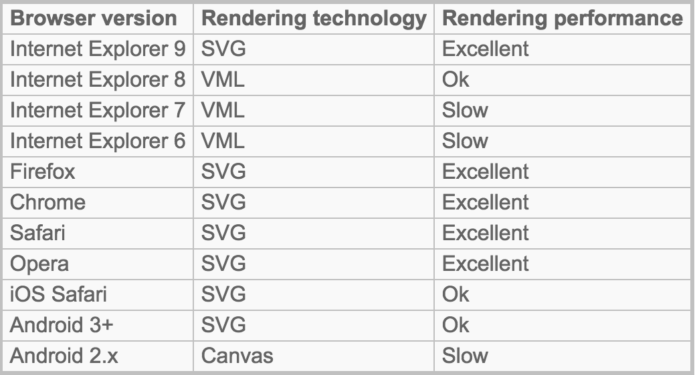
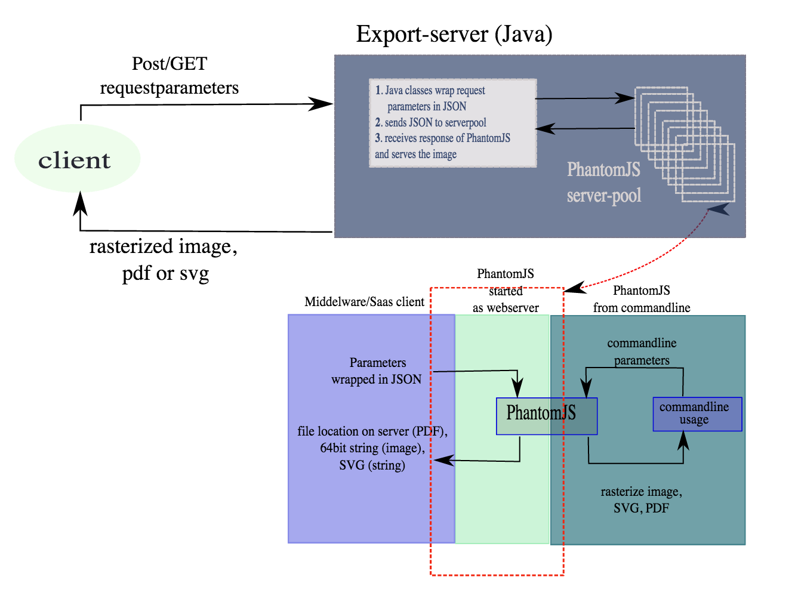
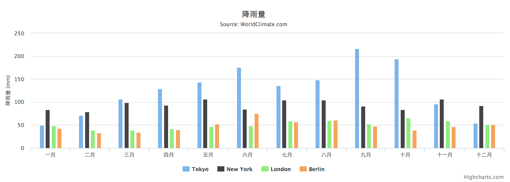
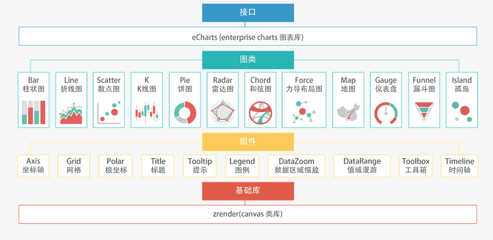
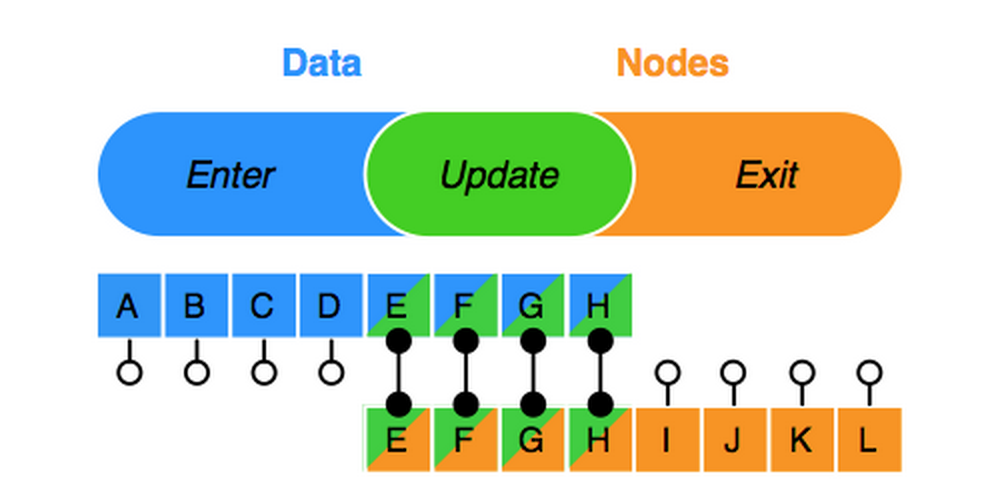

# 数据可视化技术

目前数据可视化工具多如牛毛，尤其是随着大数据炒的越来越热，数据可视化成为一个很重要的前端分支。简单了解下业内主要的可视化工具的用法，以便应对复杂多样的业务需求。

##1. 底层实现技术

1. canvas：基于像素的渲染技术，放大缩小很麻烦

2. SVG：基于XML

3. VML：只是被IE支持

##2. HighChart

1. 最大的问题：商业开发需要Money 收费标准

2. 支持IE6+，高版本浏览器使用的是SVG，IE8-使用的是VML

3. 文档非常详细，各种类型的图标均有DEMO

4. 可以与jQuery无缝对接，使用mootool、prototype库时需要adapter

5. 可以将图标转换成图片或pdf，主要是借助于http://export.highcharts.com/

6. 提供的服务可以在服务器端直接生成图标 [参考1](http://blog.davidpadbury.com/2010/10/03/using-nodejs-to-render-js-charts-on-server/)   [参考2](http://www.highcharts.com/docs/export-module/render-charts-serverside)  [参考3](https://github.com/travisghansen/highcharts-svg) ,主要是借助于phantomjs来实现

7.简单DEMO

    $(function () {
        $('#container').highcharts({
            chart: {
                type: 'column'
            },
            title: {
                text: '降雨量'
            },
            subtitle: {
                text: 'Source: WorldClimate.com'
            },
            xAxis: {
                categories: [
                    '一月','二月','三月','四月','五月','六月','七月','八月','九月','十月','十一月','十二月'
                ],
                crosshair: true
            },
            yAxis: {
                min: 0,
                title: {
                    text: '降雨量 (mm)'
                }
            },
            plotOptions: {
                column: {
                    pointPadding: 0.2,
                    borderWidth: 0
                }
            },
            series: [
            {
                name: 'Tokyo',
                data: [49.9, 71.5, 106.4, 129.2, 144.0, 176.0, 135.6, 148.5, 216.4, 194.1, 95.6, 54.4]
            },
            {
                name: 'New York',
                data: [83.6, 78.8, 98.5, 93.4, 106.0, 84.5, 105.0, 104.3, 91.2, 83.5, 106.6, 92.3]
            },
            {
                name: 'London',
                data: [48.9, 38.8, 39.3, 41.4, 47.0, 48.3, 59.0, 59.6, 52.4, 65.2, 59.3, 51.2]
            },
            {
                name: 'Berlin',
                data: [42.4, 33.2, 34.5, 39.7, 52.6, 75.5, 57.4, 60.4, 47.6, 39.1, 46.8, 51.1]
            }]
        });
    });

    var opt = {
      	chart: {
       		renderTo: 'container',
           type: 'column'
        },
    }
    var chart1 = new HighCharts.chart(opt)

## 3. echart

1. 基于canvas的图表库

2. 文档详细，且是中文的

3. 开源，不收费

4. 可以采用AMD规则的模块加载方式
5. Echarts功能非常强大，除了基础的图表功能，还有很多创新，如拖拽重计算Echarts提供商业产品常用图表库，底层基于ZRender，创建了坐标系，图例，提示，工具箱等基础组件，并在此上构建出折线图（区域图）、柱状图（条状图）、散点图（气泡图）、K线图、饼图（环形图）、地图、力导向布局图，同时支持任意维度的堆积和多图表混合展现

##4.d3

1. 不兼容低版本的浏览器

2. 通过svg实现，可以直接对DOM操作

3. 基于数据的可视化工具，将数据和SVG绑定到一起
数据 > 节点，产生enter行为；数据 < 节点，产生exit行为；节点的数据发生变化，产生update

## 参考
[http://dataunion.org/5579.html](http://dataunion.org/5579.html)
[http://www.zhihu.com/question/19929609](http://www.zhihu.com/question/19929609)
[http://www.36dsj.com/archives/14151](http://www.36dsj.com/archives/14151
)
