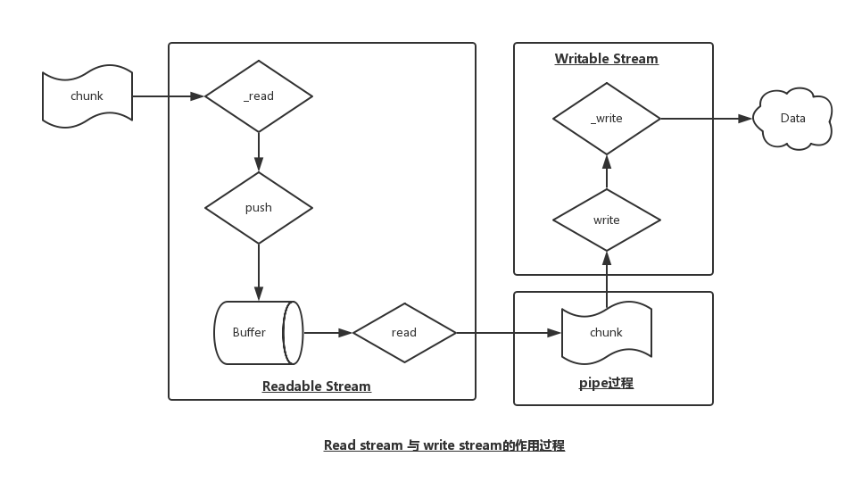
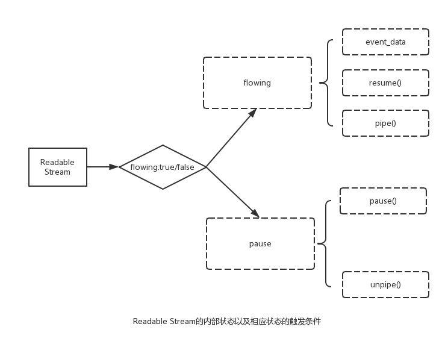
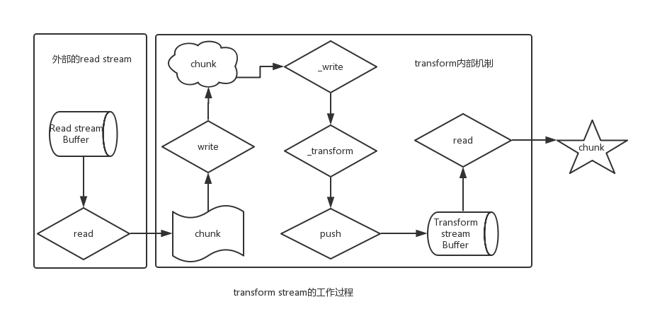

## stream

### 1. 认识Stream

- Stream的概念最早来源于Unix系统，其可以将一个大型系统拆分成一些小的组件，然后将这些小的组件可以很好地运行。
- TCP/IP协议中的TCP协议也用到了Stream的思想，进而可以进行流量控制、差错控制
- 在unix中通过 ```|```来表示流；node中通过pipe方法
- Stream可以认为数据就像管道一样，多次不断地被传递下去，而不是一次性全部传递给下游


### 2. node中的stream
在[node stream](https://nodejs.org/api/stream.html#stream_stream)中可以看到第一段的描述：

> A stream is an abstract interface implemented by various objects in Node. For
example a request to an HTTP server is a stream, as is stdout. Streams are
 readable, writable, or both. All streams are instances of EventEmitter

对上面一段话进行解析，可以得到如下几点：

- Stream是Node中一个非常重要的概念，被大量对象实现，尤其是Node中的I/O操作
- Stream是一个抽像的接口，一般不会直接使用，需要实现内部的某些抽象方法(例如_read、_write、_transform)
- Stream是EventEmitter的子类，实际上Stream的数据传递内部依然是通过事件(data)来实现的
- Stream分为四种：readable、writeable、Duplex、transform


### 3.Readable Stream 与 Writeable  Stream

#### 3.1 二者的关系

`Readable Stream`是提供数据的Stream，外部来源的数据均会存储到内部的buffer数组内缓存起来。

```writeable Stream```是消费数据的Stream，从```readable stream```中获取数据，然后对得到的chunk块数据进行处理，至于如何处理，就依赖于具体实现(也就是_write的实现)。

首先看看```Readdable Stream```与```writeable stream```二者之间的流动关系：



#### 3.2 pipe的流程解析

stream内部是如何从readable stream流到writeable stream里面呢？有两种方法：

**a) pipe 连接两个stream**

先看一个简单地demo


var Read = require('stream').Readable;
var Write = require('stream').Writable;
var r = new Read();
var w = new Write();

r.push('hello ');
r.push('world!');
r.push(null)


w._write = function (chunk, ev, cb) {
    console.log(chunk.toString());
    cb();
}

r.pipe(w);


pipe是一种最简单直接的方法连接两个stream，内部实现了数据传递的整个过程，在开发的时候不需要关注内部数据的流动：


Readable.prototype.pipe = function (dest, pipeOpts) {
	var src = this;
	...
	src.on('data', ondata);

	function ondata(chunk) {
		var ret = dest.write(chunk);
    	if (false === ret) {
      		debug('false write response, pause',
        	src._readableState.awaitDrain);
		  	src._readableState.awaitDrain++;
      		src.pause();
    	}
	}
	...
}


**b) 事件data + 事件drain联合实现**


var Read = require('stream').Readable;
var Write = require('stream').Writable;
var r = new Read();
var w = new Write();

r.push('hello ');
r.push('world!');
r.push(null)


w._write = function (chunk, ev, cb) {
    console.log(chunk.toString());
    cb();
}

r.on('data', function (chunk) {
    if (!w.write(chunk)) {
        r.pause();
    }
})

w.on('drain', function () {
    r.resume();
})

// hello
// world!


### 4 Readable Stream的模式

#### 4.1 内部模式的实现

```Readable Stream``` 存在两种模式(flowing mode 与 paused mode)，这两种模式决定了chunk数据流动的方式---自动流动还是手工流动。那如何触发这两种模式呢：

- flowing mode: 注册事件data、调用resume方法、调用pipe方法
- paused mode: 调用pause方法(没有pipe方法)、移除data事件 && unpipe所有pipe

让我们再深入一些，看看里面具体是如何实现的：


// data事件触发flowing mode
Readable.prototype.on = function(ev, fn) {
	...
	if (ev === 'data' && false !== this._readableState.flowing) {
    	this.resume();
  	}
  	...
}

// resume触发flowing mode
Readable.prototype.resume = function() {
	var state = this._readableState;
	if (!state.flowing) {
   		debug('resume');
   		state.flowing = true;
    resume(this, state);
  }
  return this;
}

// pipe方法触发flowing模式
Readable.prototype.resume = function() {
	if (!state.flowing) {
		this.resume()
	}
}


结论

- 两种方式取决于一个flowing字段：true --> flowing mode；false --> paused mode
- 三种方式最后均是通过resume方法，将state.flowing = true


#### 4.2 两种模式的操作

**a. paused mode**

在paused mode下，需要手动地读取数据，并且可以直接指定读取数据的长度:


var Read = require('stream').Readable;
var r = new Read();

r.push('hello');
r.push('world');
r.push(null);

console.log('输出结果为: ', r.read(1).toString())
// 输出结果为: 'h'


还可以通过监听事件readable，触发时手工读取chunk数据:


var Read = require('stream').Readable;
var r = new Read();

r.push('hello');
r.push('world');
r.push(null);

r.on('readable', function () {
    var chunk = r.read();
    console.log('get data by readable event: ', chunk.toString())
});

// get data by readable event:  hello world!


需要注意的是，一旦注册了readable事件，必须手工读取read数据，否则数据就会流失，看看内部实现：


function emitReadable_(stream) {
	debug('emit readable');
	stream.emit('readable');
	flow(stream);
}

function flow(stream) {
	var state = stream._readableState;
	debug('flow', state.flowing);
	if (state.flowing) {
   		do {
      		var chunk = stream.read();
	    } while (null !== chunk && state.flowing);
	}
}

Readable.prototype.read = function (n) {
	...
	var res = fromList(n, state);

	if (!util.isNull(ret)) {
		this.emit('data', ret);
	}
	...
}


flow方法直接read数据，将得到的数据通过事件data交付出去，然而此处没有注册data事件监控，因此，得到的chunk数据并没有交付给任何对象，这样数据就白白流失了，所以在触发emit('readable')时，需要提前read数据。

**b. flowing mode**

通过注册data、pipe、resume可以自动获取所需要的数据，看看内部实现：


// 事件data方式
var Read = require('stream').Readable;

var r = new Read();

r.push('hello ');
r.push('world!');
r.push(null)

r.on('data', function (chunk) {
    console.log('chunk :', chunk.toString())
})
// chunk : hello
// chunk : world!



// 通过pipe方式
var r = new Read();

r.push('hello ');
r.push('world!');
r.push(null)

r.pipe(process.stdout)
// hello world!


**c. 两种mode的总结**




### 5. transform stream的实现

用过browserify的人都知道，browserify是一种基于stream的模块打包工具，里面存在browserify.prototype.transform(tr)方法，其中的tr就要求是transform stream，且browserify内部通过```through2```构建了很多tranform stream。也可以说browserify是建立在transform stream的基础上。那么具备readable、writeablestream的transform stream内部是如何工作的呢？




### 6. 自定义stream

自定义stream很简单，只要实现相应的内部待实现方法就可以了，具体来说：

- readable stream: 实现_read方法来解决数据的获取问题
- writeable stream: 实现_write方法来解决数据的去向问题
- tranform stream: 实现_tranform方法来解决数据存放在buffer前的转换工作


// 自定义readable stream的实现
var Stream = require('stream');
var Read = Stream.Readable;
var util = require('util');

util.inherits(MyReadStream, Read);

function MyReadStream(data, opt) {
    Read.call(this, opt);
    this.data = data || [];
}
MyReadStream.prototype._read = function () {
    var _this = this;
    this.data.forEach(function (d) {
        _this.push(d);
    })
    this.push(null);
}

var data = ['aa', 'bb', 'cc'];
var r = new MyReadStream(data);

r.on('data', function (chunk) {
    console.log(chunk.toString());
})


### 7. 参考资料

- [stream-handbook](https://github.com/substack/stream-handbook)
- [node-stream](https://nodejs.org/api/stream.html)
- [iojs源码](https://github.com/nodejs/node/tree/master/lib)

