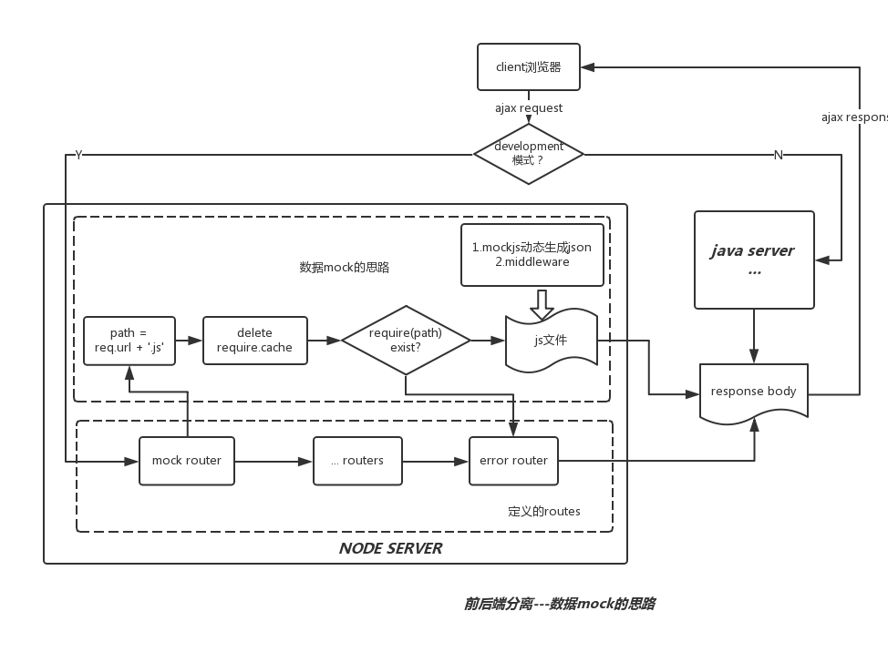

## 前后端分离 --- 数据mock思路

为了做到前后端并行开发，数据mock就成为环境搭建的重要一环。

数据mock分类两种思路：

- 在client端处数据mock
- 在server端mock。

第一种方式拦截了请求的发出，直接返回mock的数据，而第二种方式请求则真实地发出，只是在server端进行route拦截。

前后端分离的方式，就是在传统开发模式中加了一个node层，这样数据mock完全可以在node server端完成，基本思路如下：

#### 简单说明
- 只有线下开发模式(development)，才会需要进行数据mock
- 根据请求的url，拼接形成一个file path
- 为了避免node缓存，删除require.cache(path)
- 读取require(path) ，如果该文件不存在或读取失败，则跳转到失败路由
这样简单的数据mock就实现了

#### 代码描述

    // 伪代码
    if (process.env.NODE_ENV === 'development') {
      router.set('/api/*', mockapi)
    }

    function mockapi(req, res, opts) {
        var basePath = url.parse(req.url).pathname;

        try {
            var findPath = require.resolve(prefixPath + basePath + '.js');
            delete require.cache[findPath]
            var result = require(findPath);
        } catch (err) {
            return next(err);
        }
        if (typeof result === 'function') {
            return result(req, res, opts);
        }
        if (typeof result.status === 'undefined' || typeof result.body === 'undefined') {
            next(new Error('status 或 body 不存在'))
            return;
        }
        res.writeHead(result.status, {
            'Content-Type': 'application/json;charset=UTF-8'
        });

        res.write(JSON.stringify(result.body))
        res.end();
        cb()
    }
