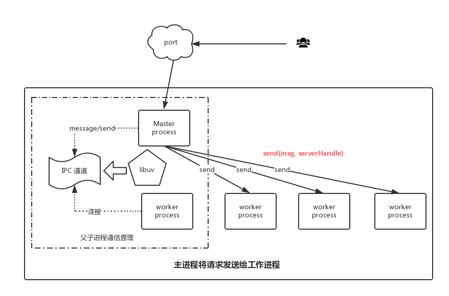
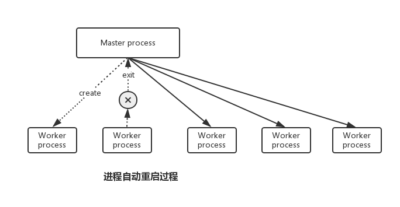

## cluster工作原理

前后端分离，在原有服务器开发模式基础上添加了node server，那node就面对如下问题：

- 请求并发
- 多核CPU的使用
- 服务的健壮性和稳定性

### 请求并发

这是node server的强项，node、nginx采用事件驱动的服务器模型，使用单线程避免了多线程的上下文切换带来的开销。

### 多核CPU的使用

node核心模块中有child_process，使用该模块可以创建子进程。类似于浏览器端的webWorker，将计算密集型的任务交给worker子进程，然后将处理结果通过postMessage返回给主线程，这样避免了js线程被阻塞。在child_prcess中存在多个创建子进程的方法(spawn、exec、execFile、fork)，其中的fork创建的是node线程，使用起来比较方便。

node已经引入了cluster模块，用于主进程与工作进程之间的管理，同时也有人做个进一步的封装，但是知道其中的原理依然非常重要，尤其是主进程与工作进程之间的通信。

**说明**

- 主进程与子进程之间通过IPC进行通信，而IPC通道内部是由libuv实现的
- child.send方法不仅可以发送消息，还可以发送server handle(内部实际发送的是文件描述符)

#### 服务的健壮性和稳定性

单线程存在一个问题：当系统存在一个未捕获的异常时，整个系统就会崩溃，无法继续提供服务。针对这个问题，创建多个进程是帮助保证服务健壮性的一个手段。同时，当某个进程崩溃时，再创建新的子进程，这样就可以保证系统中一直存在可用的进程。

### 实际代码

使用对cluster模块进行封装的[cfork](https://www.npmjs.com/package/cfork)模块，来帮助我们完成上述工作。

    var cfork = require('cfork');
    var util = require('util');

    cfork({
      exec: '/your/app/worker.js',
      // count: require('os').cpus().length,
    })
    .on('fork', function (worker) {
      console.warn('[%s] [worker:%d] new worker start', Date(), worker.process.pid);
    })
    .on('disconnect', function (worker) {
      console.warn('[%s] [master:%s] wroker:%s disconnect, suicide: %s, state: %s.',
        Date(), process.pid, worker.process.pid, worker.suicide, worker.state);
    })
    .on('exit', function (worker, code, signal) {
      var exitCode = worker.process.exitCode;
      var err = new Error(util.format('worker %s died (code: %s, signal: %s, suicide: %s, state: %s)',
        worker.process.pid, exitCode, signal, worker.suicide, worker.state));
      err.name = 'WorkerDiedError';
      console.error('[%s] [master:%s] wroker exit: %s', Date(), process.pid, err.stack);
    })

    // if you do not listen to this event
    // cfork will output this message to stderr
    .on('unexpectedExit', function (worker, code, signal) {
      // logger what you want
    });
