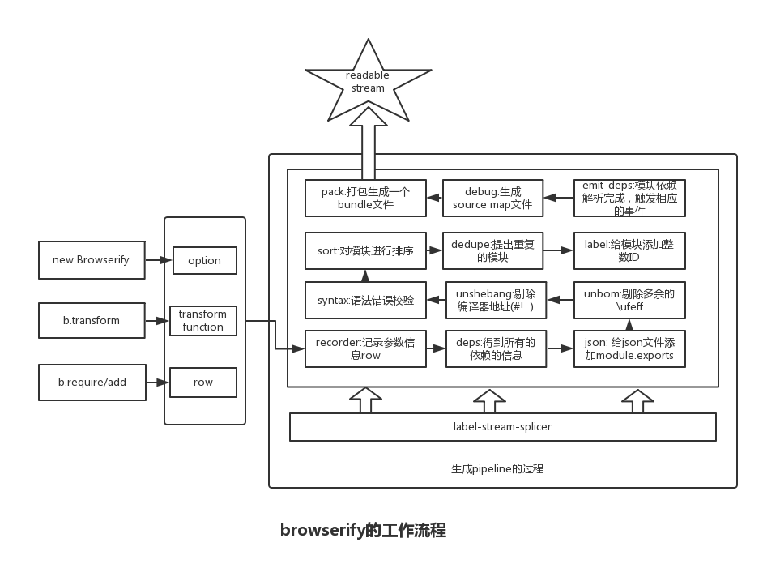

### 0. browserify是什么？

- [browserify](http://browserify.org/)是目前比较流行的模块打包工具之一(另外一个[webpack](http://webpack.github.io/))
- 基于流式(stream)思想设计
- 可以通过command line，也可以通过API来使用
- 仅处理javascript
- 模块化的逆过程，但是推动着模块化的更好发展
- 内置了一些[node core module](https://github.com/substack/browserify-handbook#builtins)
- node模块可以在浏览器端使用，是[同构应用](http://isomorphic.net/)的有力武器

### 1. 从demo说起

存在两个js: square.js、foo.js

	// square.js
	module.exports = function (a) {
	  return a*a;
	}

	// foo.js
	var sq = require('./square');
	console.log(sq(2));

接着通过API进行打包:

	var browserify = require('../node-browserify');
	var fs = require('fs');

	var b = browserify(['./foo.js']);

	b.require('./square.js', {
     expose: 'square'
	})

	b.bundle().pipe(fs.createWriteStream('./bundle.js'));

得到一个可以在浏览器端使用的bundle.js:

	(function e(t,n,r){function s(o,u){if(!n[o]){if(!t[o]){var a=typeof require=="function"&&require;if(!u&&a)return a(o,!0);if(i)return i(o,!0);var f=new Error("Cannot find module '"+o+"'");throw f.code="MODULE_NOT_FOUND",f}var l=n[o]={exports:{}};t[o][0].call(l.exports,function(e){var n=t[o][1][e];return s(n?n:e)},l,l.exports,e,t,n,r)}return n[o].exports}var i=typeof require=="function"&&require;for(var o=0;o<r.length;o++)s(r[o]);return s})({1:[function(require,module,exports){
	'use strict';

	var sq = require('./square');
	console.log(sq(2));

	},{"./square":2}],2:[function(require,module,exports){
	"use strict";

	module.exports = function (a) {
	  return a * a;
	};

	},{}]},{},[1]);

接下来分析browserify是如何做到的。

### 2. 总体设计

### 3. 具体分析

#### 3.1 输入(input)

browserfiy的输入内容整体上分为两类：file、transform function。file就是需要打包的文件，transform function用于对输入的file内容进行处理。例如：我们需要对coffeeScript文件进行打包，那么打包之前就需要将coffeeScript文件转换成javascript，然后才能进行打包。

那么输入的接口都有哪些呢：

- b = new Browserify(file, opts): 在实例化的时候，将相关内容输入进去
- b.require(file, opts): 指定可以在浏览器端require的文件
- b.add(file, opts):实例化时未指定参数的情况下，可以使用该接口
- b.external/exclude/ignore: 一些file的特殊配置
- b.transform(tr, opts): 指定transform function，用于对module进行转换

#### 3.2 处理

b.pipeline是browserify里面的核心对象。通过这个对象，可以对module进行一系列的处理，这个对象具有如下特点：

- 由[labeled-stream-splicer](https://www.npmjs.com/package/labeled-stream-splicer)生成
- 整合了很多transform stream后，生成一个整体transform stream
- 带有label，通过label访问内部具体的transform stream
- write进去的chunk分两种情况：带有file的对象，带有transform function的对象

伪代码:

	// 创建pipeline
	Browserify.prototype._createPipeline = function (opts) {
	  ...
	  var pipeline = splicer.obj([
		'record', [ this._recorder() ],
		'deps', [ this._mdeps ],
		'json', [ this._json() ],
		'unbom', [ this._unbom() ],
		'unshebang', [ this._unshebang() ],
		'syntax', [ this._syntax() ],
		'sort', [ depsSort(dopts) ],
		'dedupe', [ this._dedupe() ],
		'label', [ this._label(opts) ],
		'emit-deps', [ this._emitDeps() ],
		'debug', [ this._debug(opts) ],
		'pack', [ this._bpack ],
		'wrap', []
	  ]);
	  ...
	  return pipeline;
	}

	// pipeline write进去的chunk
	Browserify.prototype.transform = function (tr, opts) {
	  ...
	  var rec = {
		transform: tr,
		options: opts,
		global: opts.global
	  };
	  // 带有transform function的对象
	  this.pipeline.write(transform);
	  ...
	}

	Browserify.prototype.require = function (file, opts) {
	  ...
	  var rec = {
		source: buf.toString('utf8'),
		entry: defined(opts.entry, false),
		file: filename,
		id: id
	  };
	  // 带有file的对象
	  this.pipeline.write(rec);
	}

接下来针对其中关键的deps、pack进行分析。

#### 3.3 模块依赖的解析

面对的问题：

- 在模块合并前，首先要做的工作就是找出入口文件(entry file)的依赖以及依赖的依赖，例如在charpter1的demo中，入口文件foo.js仅依赖square.js
- 考虑要对源代码进行转换

browserify通过[module-deps](https://github.com/substack/module-deps)来解决上述问题，通过下面的代码可以看到解析的结果:

	var browserify = require('../node-browserify');
	var fs = require('fs');

	var b = browserify(['./foo.js'], {
	  debug: true,
	  basedir: './'
	});
	b.require('./square.js', {
	  expose: 'square'
	})
	b.on('dep', function (row) {
	  console.log(row);
	})

	b.bundle().pipe(fs.createWriteStream('./bundle.js'));

输出的JSON结果为:

	{
      "entry":true,
      "expose":false,
      "basedir":"./",
      "file":"/Users/lizhenhua/Documents/france/z-react/foo.js",
      "id":1,
      "order":0,
      "source":"'use strict';\n\nvar sq = require('./square');\nconsole.log(sq(2));\n//# sourceMappingURL=data:application/json;base64,eyJ2ZXJzaW9uIjozLCJzb3VyY2VzIjpbImZvby5qcyJdLCJuYW1lcyI6W10sIm1hcHBpbmdzIjoiOztBQUFBLElBQUksRUFBRSxHQUFHLE9BQU8sQ0FBQyxVQUFVLENBQUMsQ0FBQztBQUM3QixPQUFPLENBQUMsR0FBRyxDQUFDLEVBQUUsQ0FBQyxDQUFDLENBQUMsQ0FBQyxDQUFDIiwiZmlsZSI6ImZvby5qcyIsInNvdXJjZXNDb250ZW50IjpbInZhciBzcSA9IHJlcXVpcmUoJy4vc3F1YXJlJyk7XG5jb25zb2xlLmxvZyhzcSgyKSk7XG4iXX0=",
      "deps":{
        "./square":2
      },
      "index":1,
      "indexDeps":{
        "./square":2
      }
	}

	{
      "id":2,
      "source":"\"use strict\";\n\nmodule.exports = function (a) {\n  return a * a;\n};\n//# sourceMappingURL=data:application/json;base64,eyJ2ZXJzaW9uIjozLCJzb3VyY2VzIjpbInNxdWFyZS5qcyJdLCJuYW1lcyI6W10sIm1hcHBpbmdzIjoiOztBQUFBLE1BQU0sQ0FBQyxPQUFPLEdBQUcsVUFBVSxDQUFDLEVBQUU7QUFDNUIsU0FBTyxDQUFDLEdBQUMsQ0FBQyxDQUFDO0NBQ1osQ0FBQSIsImZpbGUiOiJzcXVhcmUuanMiLCJzb3VyY2VzQ29udGVudCI6WyJtb2R1bGUuZXhwb3J0cyA9IGZ1bmN0aW9uIChhKSB7XG4gIHJldHVybiBhKmE7XG59XG4iXX0=",
      "deps":{},
      "file":"/Users/lizhenhua/Documents/france/z-react/square.js",
      "index":2,
      "indexDeps":{}
	}

另外，在node端、browser端可能用到不同的代码，例如请求发送(参看[superagent](https://www.npmjs.com/package/superagent))，node端使用http/https模块，而浏览器端则使用XMLHttpRequest对象。为了解决该问题，browserify通过在package.json中添加[browser](https://github.com/substack/browserify-handbook#browser-field)字段来制定浏览器使用的模块。

	{
	  "name": "mypkg",
	  "version": "1.2.3",
	  "main": "main.js",
	  "browser": "browser.js"
	}

在解析的时候，则需要分别使用[resolve](https://www.npmjs.com/package/resolve)、[browser-resolve](https://www.npmjs.com/package/browser-resolve)来进行解析。

#### 3.4 模块的打包

利用[browser-pack](https://www.npmjs.com/package/browser-pack)，将上述的json数据打包合并成一个文件，browser-pack具体做了如下工作:

1. 定义浏览器端可用的require关键词

到[browser-pack](https://github.com/substack/browser-pack/blob/master/prelude.js)中可以看到如下写好的代码片段:

	(function outer (modules, cache, entry) {
    // Save the require from previous bundle to this closure if any
    var previousRequire = typeof require == "function" && require;

    function newRequire(name, jumped){
      if(!cache[name]) {
        if(!modules[name]) {
          // if we cannot find the module within our internal map or
          // cache jump to the current global require ie. the last bundle
          // that was added to the page.
          var currentRequire = typeof require == "function" && require;
          if (!jumped && currentRequire) return currentRequire(name, true);

            // If there are other bundles on this page the require from the
            // previous one is saved to 'previousRequire'. Repeat this as
            // many times as there are bundles until the module is found or
            // we exhaust the require chain.
            if (previousRequire) return previousRequire(name, true);
              var err = new Error('Cannot find module \'' + name + '\'');
              err.code = 'MODULE_NOT_FOUND';
              throw err;
            }
            var m = cache[name] = {exports:{}};
            modules[name][0].call(m.exports, function(x) {
              var id = modules[name][1][x];
              return newRequire(id ? id : x);
            },m,m.exports,outer,modules,cache,entry);
        }
        return cache[name].exports;
    }
    for(var i=0;i<entry.length;i++) newRequire(entry[i]);

    // Override the current require with this new one
    return newRequire;
    })

2.将json source合并在一起

可以对charpter1的结果进行解析，除了上述的newRequire外，还包含如下结构内容:

	(newRequire...)(source, cache, entry);

	// source 代码
	source = {
	  1:[
	    function(require,module,exports){
	      'use strict';
	      var sq = require('./square');
	     console.log(sq(2));
	    },
	    {"./square":"square"}
	  ],
	  "square":[
	  	function(require,module,exports){
		  "use strict";
		  module.exports = function (a) {
		    return a * a;
		  };
       },
       {}
      ]
    };

    // cache
    cache = {}

    // entry
    entry = [1];

上述代码片段中：

- source: 是一个map结构，key存在两种情况(默认为内部数字、显示[expose](https://github.com/substack/node-browserify#brequirefile-opts)出来的key)
- source元素分为两部分：源代码(包含的function(require, module, exports) {...})、代码中存在的依赖
- cache是缓存信息，避免再次读取souce
- entry: 是打包代码入口文件的key

### 4. browserify的使用

在ES6没有全面支持以前，browserify还会存在很长一段时间，还会有很强的生命力。相比较webpack，个人更喜欢browserify，webpack给人的感觉是一直在配置、使用plugin，并且代码结构很复杂，里面涉及大量事件，源码不容易阅读。而使用browserify给人感觉是在开发，使用起来也较为灵活，同时browserify的stream设计思路给人更多启发，可以向其他方向(例如css合并)迁移。

