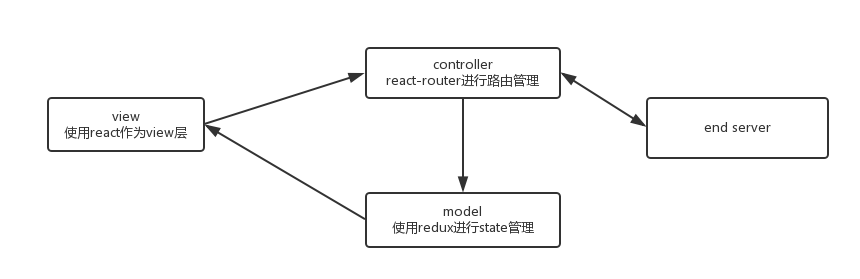
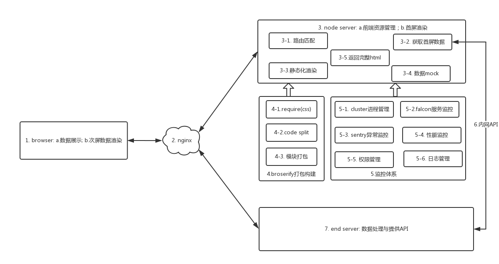

# 前端后端分离解决方案(Goku)

## 0.Goku

Goku是《七龙珠》的主人公孙悟空，神通广大，解决世间存在的问题。同样，尝试前后端分离，也希望可以解决目前前端开发中存在的痛点。

## 1.基本思路

整体上使用MVC的架构，但跟Angular不同(双向绑定)，数据是单向流动的，数据单向流动有如下的好处:

- 数据具有更好的可预测性，view层的变化一定来源于model
- 性能上更优

MVC各层使用的基本技术:

- view: 使用react作为view层渲染，这里面的渲染分为node端、浏览器端。react的虚拟DOM、专注于UI、单向流动的特点，是解决页面性能的一把利器。
- controller: react-router是建立在[history](https://github.com/rackt/history)上，用于实现页面单页面应用，同时也方面地进行路由管理。通过react-router可以方面地进行请求的分发处理。
- model: 使用了redux实现数据的流动，同时配合immutable.js来解决state的不可变性，避免引用带来的副作用。

## 2.整体架构

Goku整体架构主要存在四个实体: 浏览器(browser)、nginx、node中间层、后端sever。跟传统的网站架构相比，多了一层node中间层，该层也是Goku的核心。

## 3.详细描述

### 3.1 浏览器

因为使用了react-router，所以整个系统就是一个单页面应用(SPA):

- 当页面初始化时，首屏数据已经渲染完成，直接展示处理
- 次屏数据，需要通过ajax异步获取数据，然后在浏览器端完成渲染

这里面存在一个问题：如果保证前后端渲染的一致性? 即要求react的`data-react-checksum`前后结果保持一致。

- 首屏数据需要通过`JSON.stringify(datat)`传递给页面
- 避免生成动态内容，例如存在`new Date()`，则这个时间在node和browser渲染后就会造成不同

### 3.2 nginx

nginx已经非常流行，起到请求分发和负载均衡的作用。这里，通过nginx将不同的请求，分发到不同的服务器上:

- url请求统一分发到node server，从其中获取前端的静态资源
- api请求，直接发送到后端服务，当然也可以通过node server来中转

### 3.3 node server

node server就是一个中间层，起到两个作用:

- 前端静态资源的管理
- 首屏数据的渲染

具体来说，可以分为如下几个功能点:

#### 3.3.1 路由匹配

思路: 根据请求的URL + react router的router配置信息，得到匹配的component

	import { match, RoutingContext } from 'react-router';
	import routes from './routes';

	serve((req, res) => {
	  match({ routes, location: req.url }, (err, rediction, renderProps) => {
	    if (...) {
	      res.status(200).send(htmlStr);
	    }
	  })
	})

#### 3.3.2 获取首屏数据

思路: 每个URL均有指定的首屏数据，通过Promise.all并发地发布异步请求，当所有数据都拿到后，执行回调函数

	Promise.all([promise1, promise2, ..., promisen], (vals)=> {
	  ...
	  const initialState = val;
	  const store = createStore(reducer, initialState);
	})

#### 3.3.3 静态化渲染

思路: 使用react的`renderToString`得到静态化数据

	Promise.all([promise1, promise2, ..., promisen], (vals)=> {
	  ...
	  const initialState = val;
	  const store = createStore(reducer, initialState);
	  ...
	  const props = { store, ... };
	  str = React.renderToString(App, props);
	});

#### 3.3.4 数据mock

思路: 每个api跟一个相应的js文件对应起来，js文件通过`mockjs`的数据模板完成数据的mock

#### 3.3.5 返回完成html

思路: 将3.3得到的字符串`str`与html的其他内容(例如`mta`、`<script>`)、首屏数据(`initialState`)拼接得到一个完整的html字符串

### 3.4 browserify打包构建

通过使用browserify的transform function、plugin进行了功能的拓展，可以完成更多的事情。同时使用watchify来watch文件的变化。

#### 3.4.1 require css文件

思路: 使用css-modules，将css文件映射成一个js对象和css线上文件，在jsx中直接require css

#### 3.4.2 code split

思路：为了避免将所有的文件打包成一个js文件，使用browserify的plugin机制(使用factor-bundle插件)来进行js文件的拆分，然后使用react router的getComponent、getChildroutes完成动态加载。

#### 3.4.3 模块打包

通过3.4.2, 将文件打包成一个公共js文件、若干个业务文件，同时采用树形结构来进行文件的组织。类似于: [https://github.com/rackt/react-router/tree/master/examples/huge-apps](https://github.com/rackt/react-router/tree/master/examples/huge-apps)

### 3.5 监控体系

为了保证node服务的稳定性，需要进行一些监控，保证服务的稳定性，包括：node进行管理、falcon机器监控、sentry收集浏览器异常、性能监控、权限管理、日志管理

### 3.6 node与后端服务通信

目前是通过一个内网域名进行访问，当然这种方式存在一些问题：多一次域名解析、访问协议等。

### 3.7 后端服务

在这种架构下，后端服务只提供API，不再涉及后端模板、URL controller，后端同学可以专注于数据处理，不需要留意页面展示，前后端分工更加明确。

## 4.最近的思考

### 4.1 前后端分离的代价与收益

先说感受最深的收益吧：

- 速度: 前端开发不再依赖于后端服务、后端数据，这样可以加快开发速度
- 职责: 前后端分工更加明确，前端侧重于数据展示、交互处理，后端侧重于数据处理、数据存储

代价：

- 复杂: 多了一个中间层，造成整个架构变得更加复杂
- 维护: 为了node的稳定、可靠，需要投入大量的时间用于node服务的维护
- 冲突: 对后端是一个挑战，开发前期后端根本无法查看页面，需要耐心解释
- 性能: 在首屏渲染的时候，node服务需要访问后端服务，肯定存在性能上的损失

针对上述问题，个人认为，目前前后端分离适合于一些访问量不大的内部系统，而对于大pv量的页面，还是采用传统的两层架构(B/S)。

### 4.2 前端工程师的发展方向

- web应用: 随着云计算的发展，越来越多的应用将网络化(例如现在创业红海Sass应用)，这样前端工程师就需要面对越来越复杂的业务场景
- 数据可视化: 这跟大数据有很大关系，这个方向的难点在于图形学上的内容
- 移动化: 移动互联网时代已经来临，H5开发越来越多，很多公司的战略是移动优先
- 全端化: Andriod、IOS、FE均工作于客户端，随着react native的出现，三者有融合的趋势
- 全栈化: 目前的前后端分工有好处，但是也造成了很多不必要的沟通，同时人为地将整个网站开发割裂开来，回归全栈开发也是一个趋势
