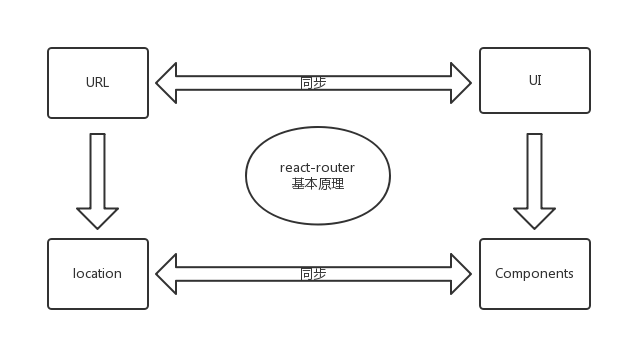
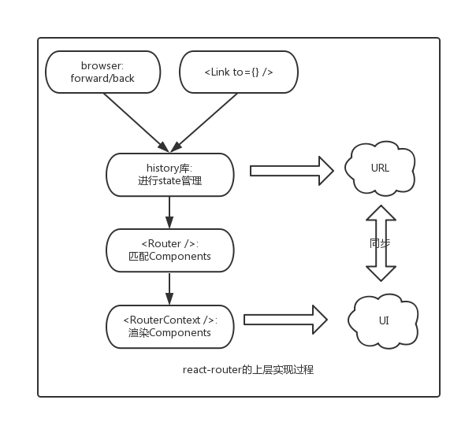

# react-router的实现原理

目前，`react`的生态越来越丰富，像`flux` `redux` `react-router`已经被越来越多的使用，本文就`react-router`的内部实现进行分析。文章主要包含两大部分: 一是对`react-router`赖以依存的`history`进行研究；二是分析`react-router`是如何实现`URL`与`UI`同步的。

## 1. react-router的依赖基础 - history

### 1.1 History的整体介绍

[history](https://github.com/reactjs/history/blob/master/docs/Glossary.md?name=232#sssss)是一个独立的第三方js库，可以用来兼容在不同浏览器、不同环境下对历史记录的管理，拥有统一的API。具体来说里面的history分为三类:

- 老浏览器的history: 主要通过hash来实现，对应`createHashHistory`
- 高版本浏览器: 通过html5里面的history，对应`createBrowserHistory`
- node环境下: 主要存储在memeory里面，对应`createMemoryHistory`

上面针对不同的环境提供了三个API，但是三个API有一些共性的操作，将其抽象了一个公共的文件`createHistory`:

	// 内部的抽象实现
	function createHistory(options={}) {
	  ...
	  return {
	    listenBefore, // 内部的hook机制，可以在location发生变化前执行某些行为，AOP的实现
	    listen, // location发生改变时触发回调
	    transitionTo, // 执行location的改变
	    push, // 改变location
	    replace,
	    go,
	    goBack,
	    goForward,
	    createKey, // 创建location的key，用于唯一标示该location，是随机生成的
	    createPath,
	    createHref,
	    createLocation, // 创建location
	  }
	}

上述这些方式是history内部最基础的方法，`createHashHistory`、`createBrowserHistory`、`createMemoryHistory`只是覆盖其中的某些方法而已。其中需要注意的是，此时的location跟浏览器原生的location是不相同的，最大的区别就在于里面多了`key`字段，`history`内部通过`key`来进行`location`的操作。

	function createLocation() {
	  return {
	    pathname, // url的基本路径
	    search, // 查询字段
	    hash, // url中的hash值
	    state, // url对应的state字段
	    action, // 分为 push、replace、pop三种
	    key // 生成方法为: Math.random().toString(36).substr(2, length)
	  }
	}

### 1.2 内部解析

三个API的大致的技术实现如下:

- `createBrowserHistory`: 利用HTML5里面的history
- `createHashHistory`: 通过hash来存储在不同状态下的history信息
- `createMemoryHistory`: 在内存中进行历史记录的存储

#### 1.2.1 执行URL前进

- `createBrowserHistory`: pushState、replaceState
- `createHashHistory`: `location.hash=***` `location.replace()`
- `createMemoryHistory`: 在内存中进行历史记录的存储

伪代码实现如下:

	// createBrowserHistory(HTML5)中的前进实现
	function finishTransition(location) {
	  ...
	  const historyState = { key };
	  ...
	  if (location.action === 'PUSH') ) {
	    window.history.pushState(historyState, null, path);
	  } else {
	    window.history.replaceState(historyState, null, path)
	  }
	}
	// createHashHistory的内部实现
	function finishTransition(location) {
	  ...
	  if (location.action === 'PUSH') ) {
	    window.location.hash = path;
	  } else {
	    window.location.replace(
        window.location.pathname + window.location.search + '#' + path
      );
	  }
	}
	// createMemoryHistory的内部实现
	entries = [];
	function finishTransition(location) {
	  ...
	  switch (location.action) {
	    case 'PUSH':
	      entries.push(location);
	      break;
	    case 'REPLACE':
	      entries[current] = location;
	      break;
	  }
	}

#### 1.2.2 检测URL回退

- `createBrowserHistory`: `popstate`
- `createHashHistory`: `hashchange`
- `createMemoryHistory`: 因为是在内存中操作，跟浏览器没有关系，不涉及UI层面的事情，所以可以直接进行历史信息的回退

伪代码实现如下:

	// createBrowserHistory(HTML5)中的后退检测
	function startPopStateListener({ transitionTo }) {
	  function popStateListener(event) {
	    ...
	    transitionTo( getCurrentLocation(event.state) );
	  }
	  addEventListener(window, 'popstate', popStateListener);
	  ...
	}

	// createHashHistory的后退检测
	function startPopStateListener({ transitionTo }) {
	  function hashChangeListener(event) {
	    ...
	    transitionTo( getCurrentLocation(event.state) );
	  }
	  addEventListener(window, 'hashchange', hashChangeListener);
	  ...
	}
	// createMemoryHistory的内部实现
	function go(n) {
	  if (n) {
	    ...
	    current += n;
      const currentLocation = getCurrentLocation();
      // change action to POP
      history.transitionTo({ ...currentLocation, action: POP });
	  }
	}

#### 1.2.3 state的存储

为了维护state的状态，将其存储在sessionStorage里面:

	// createBrowserHistory/createHashHistory中state的存储
	function saveState(key, state) {
	  ...
	  window.sessionStorage.setItem(createKey(key), JSON.stringify(state));
	}
	function readState(key) {
	  ...
	  json = window.sessionStorage.getItem(createKey(key));
	  return JSON.parse(json);
	}
	// createMemoryHistory仅仅在内存中，所以操作比较简单
	const storage = createStateStorage(entries); // storage = {entry.key: entry.state}

	function saveState(key, state) {
	  storage[key] = state
	}
	function readState(key) {
	  return storage[key]
	}

## 2. react-router的基本原理

一句话：实现URL与UI界面的同步。其中在react-router中，`URL`对应`Location`对象，而UI是由react `components`来决定的，这样就转变成`location`与`components`之间的同步问题。

## 3. react-router的具体实现

react-router在`history`库的基础上，实现了URL与UI的同步，分为两个层次来描述具体的实现。

### 3.1 组件层面描述具体实现过程

在`react-router`中最主要的`component`是`Router` `RouterContext` `Link`，`history`库起到了中间桥梁的作用。

### 3.2 API层面描述具体实现过程

为了简单说明，只描述使用browserHistory的实现，hashHistory的实现过程是类似的，就不在说明。

## 4. 结语

目前`react-router`在项目中已有大量实践，其优点可以总结如下:

- 风格: 与React融为一体,专为react量身打造，编码风格与react保持一致，例如路由的配置可以通过component来实现
- 简单: 不需要手工维护路由state，使代码变得简单
- 强大: 强大的路由管理机制，体现在如下方面
	- 路由配置: 可以通过组件、配置对象来进行路由的配置
	- 路由切换: 可以通过`<Link>` `Redirect`进行路由的切换
	- 路由加载: 可以同步记载，也可以异步加载，这样就可以实现按需加载
- 使用方式: 不仅可以在浏览器端的使用，而且可以在服务器端的使用

当然`react-router`的缺点就是API不太稳定，在升级版本的时候需要进行代码变动。

