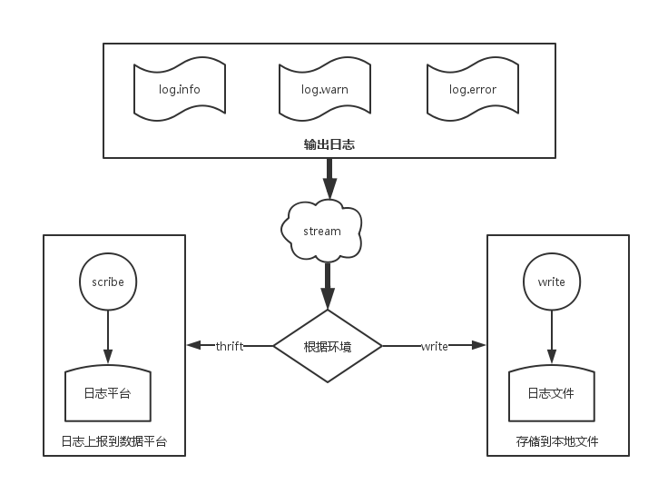

# node日志处理实践

日志用来记录用户操作、系统运行状态等，是一个系统重要的组成部分。系统出现问题时，日志的好坏关系到问题定位的速度，同时可以通过对日志的观察和分析，提前发现系统可能存在的问题，避免线上事故的发生。

node日志跟后端日志没有区别，所以在日志实践过程中，一直在学习后端在日志管理上的经验，尽量跟后端日志规范、风格保持一致，便于公司运维维护管理。

## 1. 日志场景

### 1.1 模块中的日志处理

node模块中不建议打印日志，如果需要在某些场景下打印日志，可以使用`debug`模块。

```
const debug = require('debug')('my-module');
debug('the param is: %s', param);
```
正常情况执行 `node file.js`，是不会打印上述日志的，只有添加环境变量`DEBUG=my-module node file.js`后才会打印上述日志。

### 1.2 应用中的日志处理

在`node-bunyan`模块的基础上，进行了封装，满足业务的需要。


## 2. 日志处理

收集到的日志会进行两种处理:

### 2.1 开发环境

实时日志打印到终端，开发时，可以试试查看。

### 2.2 生产环境



- 错误日志上报到sentry
- 实时日志存储在本地文件，自动分割，临时存储30天
- 延时日志发送到flume，持久存储

## 3. 日志格式

日志分为三部分: prefix、tags、mesage。

### 3.1 prefix

日志的基本信息，所有日志均存在的内容:

- time: 日志产生的时间
- hostname: 日志来源的机器名
- pid: 进程的id
- level: 日志的级别，只采用`info`、`warn`、`error`
- name: 日志所属的应用
- action: 日志的行为，例如诊断日志、访问日志、管理日志
- version: 日志的版本，用于日志的升级

### 3.2 tags

在日志上报到数据中心时，可以创建K-V自定义字段，sql查询时可以建立索引，目前使用的tags如下:

- requestID: 用于HTTP请求的追踪
- userID: 某个用于行为的追踪

### 3.3 message

日志信息部分，在打印日志时，每条日志包含供问题排查的关键信息。日志接入统一日志中心，该字段会做数据远程上报，不会做索引处理。


## 4. 日志注意事项

- 不要打印敏感信息, 例如身份证号、密码等
- 绝不要打印没有用的日志，防止无用日志淹没重要信息


## 参考

- [https://blog.risingstack.com/node-js-logging-tutorial/](https://blog.risingstack.com/node-js-logging-tutorial/)
- [https://cattail.me/tech/2015/09/15/logging-with-userid-and-requestid.html](https://cattail.me/tech/2015/09/15/logging-with-userid-and-requestid.html)
- [https://github.com/mt-hfe/article/issues/1](https://github.com/mt-hfe/article/issues/1)
- [http://f2e.souche.com/blog/ri-zhi-gui-fan-hua-yu-fen-xi-jian-kong/](http://f2e.souche.com/blog/ri-zhi-gui-fan-hua-yu-fen-xi-jian-kong/)
- [http://blog.jobbole.com/56574/](http://blog.jobbole.com/56574/)