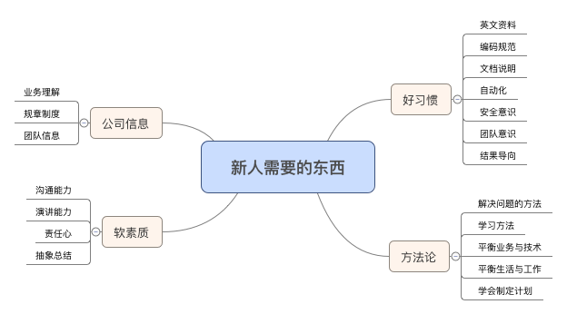
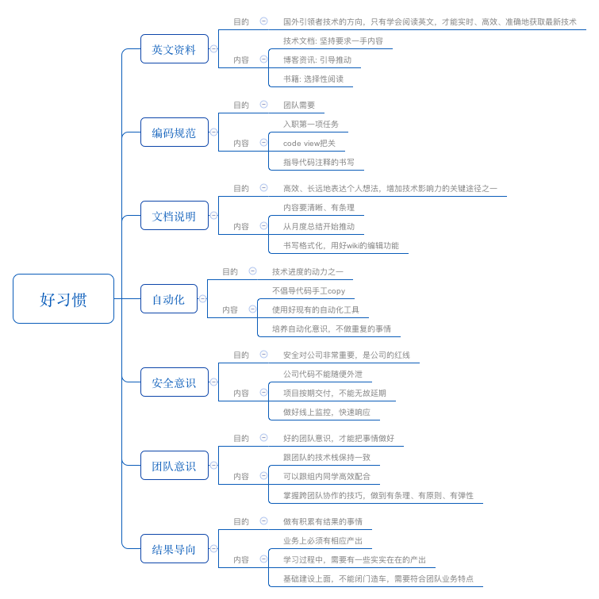
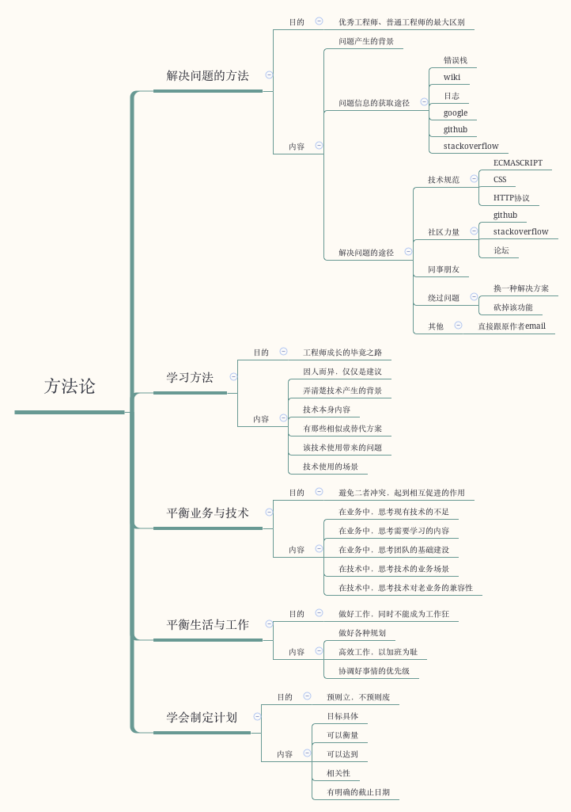
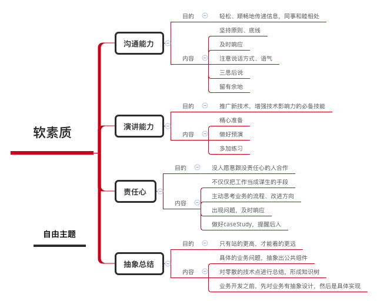
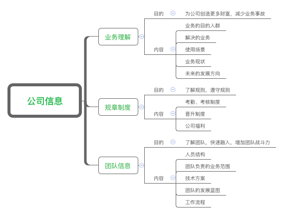
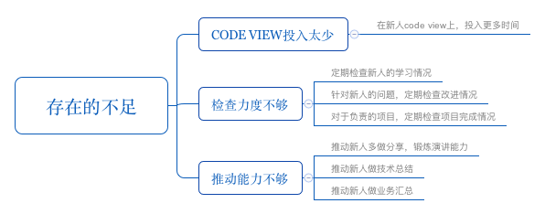

## 新人指导心得体会

两年多以前，自己还是一个懵懵懂懂的新人，转眼间，断断续续带过一些新人，在这个过程中遇到过一些问题，走过一些弯路，也在这个过程中有不少收获。加上，最近去西安校招，面试了很多应届生，他们有很多优点，同时也存在的一些不足。因此本文在自己有限经验的基础上，总结下对新人入职后，需要在哪些方面进行指导。

新人指导的过程，也是自己思考的一个过程，这是一个相互影响的过程:

- 新人的优点，值得去学习
- 新人的缺点，自己身上也可能存在
- 对新人的要求，可能自己也没达到
- 对新人的指导，也是在构建知识体系

## 一、概述

## 二、培养好的习惯

## 三、形成自己的方法论

## 四、注意软素质培养

## 五、同步公司信息

## 六、目前存在的不足

