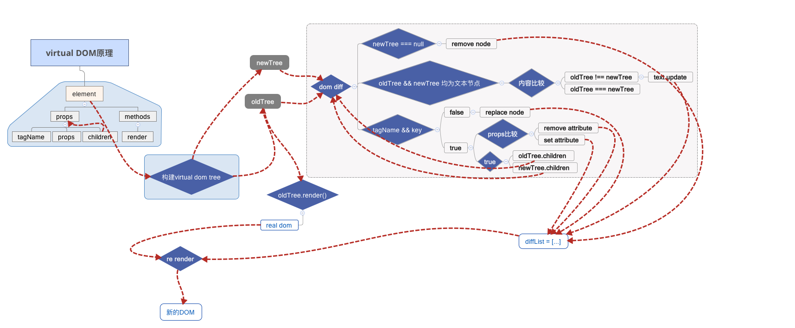
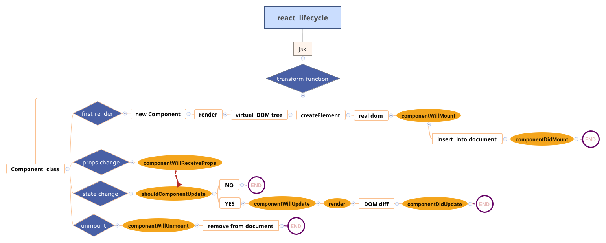
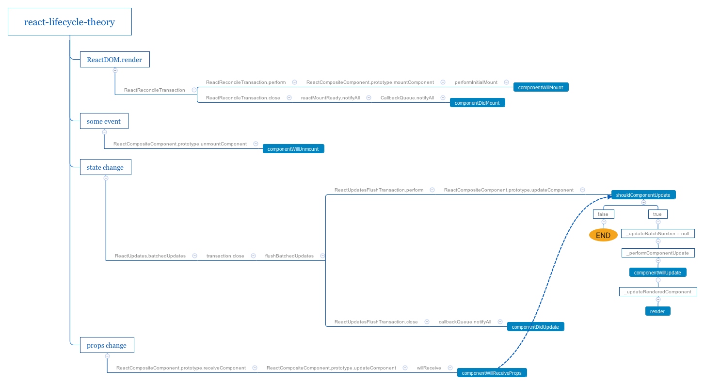
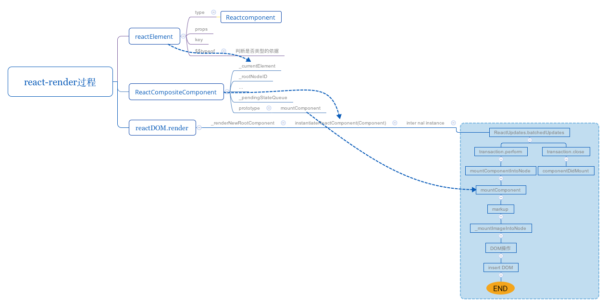
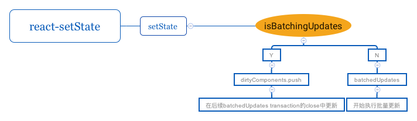
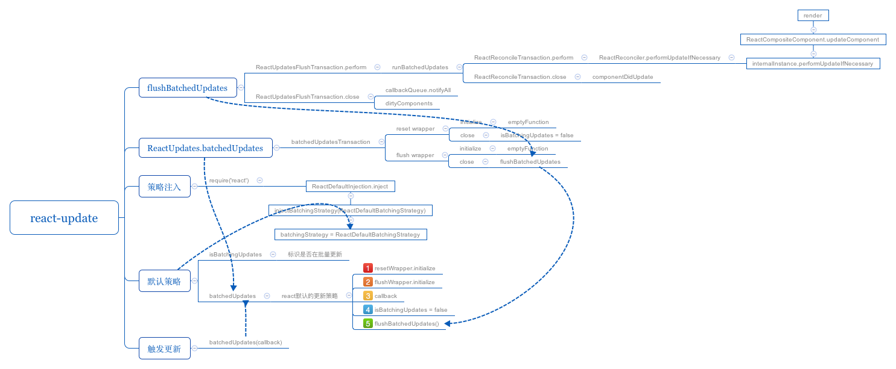

## React源码解析

最近阅读了`react`部分源码，重点研究了virtual dom、生命周期、reactDOM.render、setState异步原理、react更新策略等问题，收获不少，解决了不少心中的疑惑，用思维导图的方式记录其中的逻辑关系。

### 1. Virtual DOM

### 2. 生命周期

#### 2.1 生命周期的基本流程

#### 2.2 生命周期的内部实现逻辑

### 3. React 首次渲染

### 4. setState异步的原理

### 5. React更新原理

### 参考

- [https://undefinedblog.com/what-happened-after-set-state/](https://undefinedblog.com/what-happened-after-set-state/)
- [https://zhuanlan.zhihu.com/p/20328570?refer=purerender](https://zhuanlan.zhihu.com/p/20328570?refer=purerender)
- [http://purplebamboo.github.io/2015/09/15/reactjs_source_analyze_part_one/](http://purplebamboo.github.io/2015/09/15/reactjs_source_analyze_part_one/)