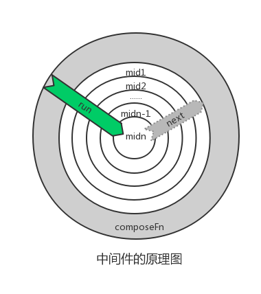

# 前端开发中的中间件

中间件(middleware)技术由来已久，在服务端是一个很常见的概念，大的公司有专门的中间件团队，通过middleware连接组件、系统、服务，减少应用层开发的复杂度。随着前端技术的发展，midddleware也在很多地方出现，例如redux、koa。本文基于个人有限的了解，简单分析下前端中间件的实现原理。

<div style="margin: 0 auto; width: 100%; text-align: center"></div>

## 基于回调函数的实现

假如存在如下三个middleware，希望依照顺序执行三个middleware:

```
function mid1(next) {
  return () => {
    console.log('first mid1.1')
    next()
    console.log('first mid1.2')
  }
}
function mid2(next) {
  return () => {
    console.log('first mid2.1')
    next()
    console.log('first mid2.2')
  }
}
function mid3(next) {
  return () => {
    console.log('first mid3.1')
    next()
    console.log('first mid3.2')
  }
}
var noop = () => {}
mid1(mid2(mid3(noop))()
```
上面的代码可以按照次序顺序执行，但是会出现层层嵌套的问题，如何让代码优雅起来呢？下面是一种实现思路:

```
function noop() {}
function compose(arrFn) {
  var last = arrFn[arrFn.length - 1];
  var rest = arrFn.slice(0, -1);
  return function() {
    var next = next || noop;
    return rest.reduceRight(function(pre, item) {
      return item(pre);
    }, last(next))
  }
}

const fn = compose([mid1, mid2, mid3]);
fn()();
```
其实[redux里面的compose](https://github.com/reactjs/redux/blob/master/src/compose.js)就是这样的实现方式，通过高阶函数避免了函数的层层嵌套。

## 基于generator的实现方式

业内流行的新一代node框架koa，使用generator进行流程控制，不仅是另外一种middleware的实现方式，而且可以解决异步编程的回调嵌套问题。

```
var koa = require('./koa');
var app = koa();
app.use(function* (next) {
  console.log('access logger begin %s', this.request.url);
  yield next;
  console.log('access logger end');
});
app.use(function* (next){
  var begin = new Date();
  yield next;
  console.log('use time %d', new Date - begin);
})
app.use(function* () {
  this.body = yield new Promise(function (resolve) {
    setTimeout(() => {
      resolve('hello midddleware');
    }, 100)
  })
});
app.listen(3000);
```

上面的逻辑是如何实现的呢?

```
// 首先对middleware进行聚合
app.use = function(fn) {
  this.middleware.push(fn);
}
app.callback = function () {
  var fn = co.wrap(compose(this.middleware));
  return function handleRequest(req, res) {
    fn.call(ctx).then(() => {
      ....
    }).catch(function (err) {
      ...
    })
  }
}
```

代码分析: 在koa中，每个middleware都是一个`Generator function`，同时接受一个`next`参数，该参数是一个`Generator object`，也就是后面middleware执行的结果。直观上，按照mid1(mid2(mid3(...)))的方式实现，为了增加代码的可读性，使用`compose`进行了处理。

```
function compose(middleware){
  return function *(next){
    if (!next) next = noop();

    var i = middleware.length;

    while (i--) {
      next = middleware[i].call(this, next);
    }

    return yield *next;
  }
}
function *noop(){}
```

也就是执行`compose(this.middleware)`之后，得到的仍然是一个`Generator function`，接下来的问题就是如何将其自动运行下来？为此TJ写了[co模块](https://github.com/tj/co)来实现`Generator`的run:

```
function co(gen) {
  return new Promise((resolve, reject) => {
    ....
    gen = gen();
    ...
    function onFulfilled(result) {
      var ret = gen.next(result);
      next(ret);
    }
    function next(ret) {
      if (ret.done) return resolve(ret.value);
      var val = toPromise.call(ctx, ret.value);
      if (val && isPromise(val)) return val.then(onFulfilled)
    }
  })
}
function toPromise(obj) {
  ...
  if (isPromise(obj)) return obj;
  if (isGeneratorFunction(obj) || isGenerator(obj)) return co.call(ctx, obj);
  if (typeof obj === 'function') return thunkToPromise.call(ctx, obj);
  ...
}
```

代码解读:

co的执行对yield后面的表达式的值是有要求的, 最小的数据元素必须是其中的一种: promise、thunk function、generator function、generator object。然后在内部存在类型转换, 将不是promise的对象转变成promise，通过successCallBack将结果传给上一个`yield expression`。这样就可以实现`Generator`的自动运行。

## 结语

上面是开发中自己遇到的两种`middleware`实现机制，当然还有其他的实现，以后开发中慢慢积累吧。
