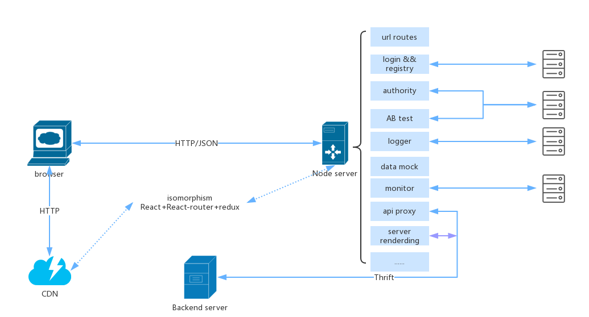
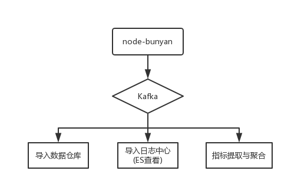

# 前后端分离实践及思考

从15年年底开始，团队开始实践基于node的前后端分离，在这一年多的时间里，不断尝试和摸索，积累了一些经验，同时仍然存在一些需要解决的问题，利用闲暇时间，总结下其中的思考。

## 1. 主体设计

前后端分离的架构主要分为四部分: 浏览器端、node server、CDN、Backend sever。整体的结构设计如下图:




下面针对几个问题，总结下实践经验。


## 2 前端资源

浏览器页面的资源主要分为两类: 动态html、静载资源，这两种资源来自于不同的服务。

### 2.1 资源的类型

####  动态html

用React实现同构应用，因此不需要前端模板，使用`ReactDOMServer.renderToString`得到html片段，然后再拼接成完成的html页面:

```
const store = redux.createStore(rootReducer, initialState, storeEnhancer);
return (`<!doctype html>
<html>
	<head>
		<title>${...}</title>
		<meta ...>
		<link href=${...} />
	</head>
	<body>
		<div>html fragment</div>
		<div id="${appName}">${ReactDOMServer.renderToString(ele)}</div>
		<div>...</div>
		<script>
			window.initState = ${JSON.stringify(store.getState())}
		</script>
		<script src="${...}"></script>
	</body>
</html>`);
```
有几点说明:

- html模板: 针对不同场景(pc、mobile、兼容IE8)，使用不同的html模板
- 初始数据: 需要将redux的初始化数据，作为html的一部分传递过来，只有这样才能保证前后端渲染的一致性(data-react-checksum计算结果一样)


#### 静态资源

静态资源包括: javascript、css、image、icon等，这些资源在部署的时候会同步到公司的CDN上，而上述html中的静态资源请求，也会到达CDN服务上。

### 2.2 资源的生产

使用babel && webpack 对javascript、css、image进行编译打包，实现从src(es6) --> lib(es5) --> dist(bundle.version.js)过程。

### 2.3 资源的部署

前后分离之后，前端就可以单独部署。因此，部署过程中，需要将一部分资源部署到node服务，另外一部分资源部署到cdn上。

## 3. 通信问题

### 3.1 浏览器层面

受限于浏览器本身，浏览器层面的通信很简单，依赖于HTTP协议进行数据的获取，而数据的格式则使用常见的JSON格式。

### 3.2 服务之间的通信

以前，服务之间的通信用到是HTTP协议，但是HTTP协议存在如下问题:

- HTTP协议是无状态协议，需要通过三次握手建立连接
- 传输效率也不高，存在较多冗余内容(大量header信息)
- 通信双方，对数据格式要求，不存在约束限制，数据同步是个大问题

基于以上原因，开始逐步使用Thrift框架来实现RPC(remote process call)，提高通信的效率，降低由于数据格式不一致造成的错误。

## 4. Node服务的功能

随着在业务中的不断尝试，node层的功能也越来越丰富，除了基本的url routes、数据mock、api proxy、server rendering外，团队已经将一些公共服务(例如登录注册、页面权限、ABtest、监控、日志收集)提取出来，作为基础服务进行维护。下面简单介绍几个功能:

### 4.1 server rendering

服务端渲染仍然走redux流程，也就是说，通过action来改变store数据，保证前后端均是通过redux实现数据的单向流动。大概思路如下:

```
const actionCreator1 = require('./actions/...');
const http = require('http');
http.request(opts, (res) => {
	let data = '';
	res.on('data', (chunk) => {
		data = `${data}${chunk}`;
	});
	res.on('end', () => {
		try {
			const d = JSON.parse(data);
			actionCreator1(d);
		} catch(err) {
			...
		}
		
	})
});

// actionCreator1实现
function actionCreator1(data) {
	return (dispatch) => {
		dispatch({
			type: '...',
			payload: data,
		});
	};
}

```

### 4.2 基础服务(如登录注册、页面权限）

对于这些公司内的基础服务，已经把这些功能抽离处理，作为团队的基本模块来维护，减少开发成本，提高效率。为了增加代码的可读性，没有使用middleware，而是通过使用一个高阶函数来实现:

```
// 例如，将登录模块封装成 @scope/login
const defaultOpts = { ... };

module.exports =  function loginFactory(opts) {
	const finalOpts = extend({}, defaultOpts, opts);
	return (router) => {
		return (req, res) => {
			if (loginSuccess) {
				router(req, res);
			} else {
				// 去登录门户输出账号、密码
			}
		}
	}

}
```

### 4.3 日志处理

作为服务的主要一环，日志的收集、处理、查询变得很重要。为了降低开发成本，按照公司的规范，将相关内容接入到公司的日志处理平台:



在日志收集环节，用的是node-bunyan模块，该模块也被node官方团队使用。该模块不仅将日志数据用json表示，而且还提供了可视化展示功能。考虑到兼容性，有些日志用的是console输出，因为做了如下处理:

```
function streamHook(ws) {
	const oldWrite = ws.write;
	ws.write = function (chunk, encoding, next) {
		var newChunk = chunk;
		if (chunk not created by bunyan) {
			...
		}
		oldWrite(newChunk);
	}
}
streamHook(process.stdout);
streamHook(process.stderr);
```

## 5 一些思考及后续计划

### 5.1 从npm过渡到yarn

npm是node的内置包管理工具，但是npm存在如下问题:

- 版本管理教繁琐: 版本问题是线上事故的高发地带，为了解决该问题，目前的做法执行`npm shrinkwrap`生成npm-shrinkwrap.json文件，来锁定版本号，该过程比较繁琐
- 耗时较长: cache下面的文件没有得到充分利用，这样造成部署的时候也被拖长

去年Facebook推出了yarn，可以很好地解决上述两个问题，年前在一个项目中尝试了一下，效果还不错，有必要在团队内推广。

### 5.2 压力和性能测试

随着node功能逐渐增多，如何保证node服务性能，如何今早发现内存泄露问题，必须成为一个需要提交考虑的问题。最近尝试了几个简单的工具(ab、siege、Jmeter)，可以在一定的并发条件下，测试服务的性能，观察内存、CPU的使用情况，后续需要深入下去。

### 5.3 尝试分块传输(BigPipe)

如果存在服务端渲染的话，页面的首字节时间明显会变长，这样白屏时间就会变长，在node服务中尝试数据的分块传输，可以解决这个问题。至于如何实现，还需要更多地思考和尝试。

### 5.4 GraphQL

目前团队中的有些需求，数据来源比较多，是否可以尝试GraphQL进行数据的聚合查询？对于更加复杂的业务，是否可以引入`Relay`来构建React应用？这也是一个可以尝试的地方。

### 5.5 缩短编译时间

Babel帮助我们提前使用一些浏览器未支持的语法，加快开发速度，但是随之而来，编译成为开发过程的一个瓶颈环节，尤其是当构建的内容变多的时候。如果提高编译效率，缩短编译时间，不仅仅关系到开发体验，而且明显影响部署时间。

### 5.6 引入PM2

之前的应用比较简单，加上对PM2不太了解，为了保证应用的简单可追溯，就没有使用PM2进行进程管理，而是直接使用cluster实现的。随着应用的复杂度，应该尝试去了解PM2的实现，在项目中引入PM2，更好地解决进程问题。


