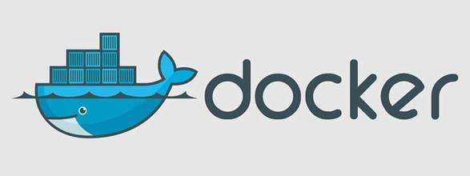

# Docker使用



Docker是一个虚拟环境容器，可以将应用代码、环境配置、系统环境等一并打包在一起，生成一个镜像，然后就可以发布到任意平台上。

## 与VM的区别


VM在物理机的操作系统上建立了一个中间软件层 hypervisor，利用物理机资源，虚拟出多个硬件资源，这些新的虚拟硬件环境、安装的操作系统、相应软件便构成了一台虚拟机

而 Docker 对硬件资源，在不同docker container上做了隔离，使得每个docker container拥有不同的环境，同时可以共享硬件资源

## 日常使用的基本概念


核心功能简答介绍:

- Docker是C/S模式
- images：docker镜像，是Docker run的原材料
- container: Docker运行的内容，是独立存在的
- data volumes: 通过数据挂载的方式，实现数据共享
- network：用户容器与外部、容器之间的通信，常用的方法有端口映射、link等

## 使用流程


## 基本操作

- docker version: 查看基本版本信息，包括client、server

### 关于镜像的基本操作

- docker search: 默认在 [https://hub.docker.com](https://hub.docker.com) 中查询镜像，当然可以修改registry
- docker pull: 镜像拉取 `docker pull imageName:version`
- docker push: 镜像提交
- docker images: 查看本地镜像
- docker rmi: 删除本地镜像
- docker build：利用 Dockerfile 制作镜像，例如 `docker build -t newImageName -f dockerFile [contextPath]`
- docker commit: 基于运行的 container 制作镜像

### 关于容器的基本操作

- docker run
  - 镜像的运行
  - d: 在后台运行
  - v: 用户数据挂载
  - p: 端口映射，实现外部与容器之间的通信
  - rm: 容器推出时，直接删除容器
  - i: 交互式的方式
  - t: 在容器中启动一个终端
- docker ps
  - 查询当前存在的容器
  - a: 列出所有容器
  - q: 仅出 container id
- dock exec: 在容器中执行命名，例如可以使用 `docker exec -it containerId /bin/bash` 进入到容器内部
- docker stop: 停止容器的运行
- docker restart: 重新启动容器的运行
- docker rm: 容器删除


## DockerFile

```
# 指定基础镜像
FROM NODE:10.12

## 从本地 copy 文件到镜像中
COPY ./ /data/my-node/

## 切换 container 的工作目录
WORKDIR /data/my/node

## 执行命令
RUN npm install


## 容器的启动命名
ENTRYPOINT ["node", "./index.js"]

```
