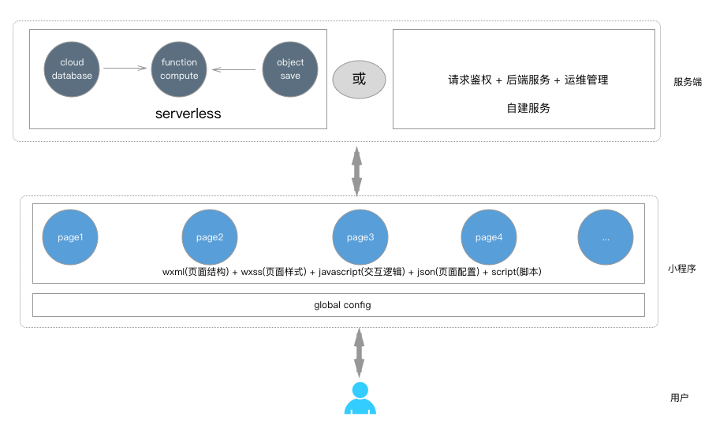
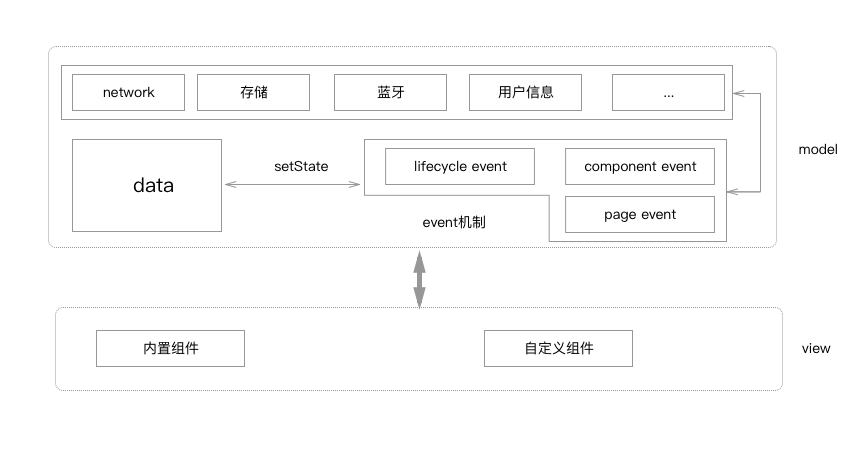

## 把玩微信小程序

16年底小程序刚公测的时候，研究了小程序的开发过程，技术实现过程没有太大的区别。事过两年之后，因为涉足 serverless 领域，发现小程序是很好的 `云 + 端` 模式，同时微信小程序推出了 serverless 开发模式，因此重新又把玩了一番。两次涉足相同的内容，但是关注点完全不同。

--- 

### 16年底的记录

--- 

### 18年10月把玩记录

