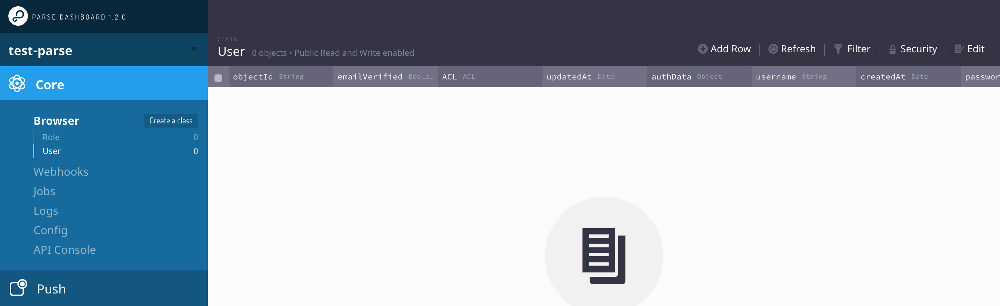
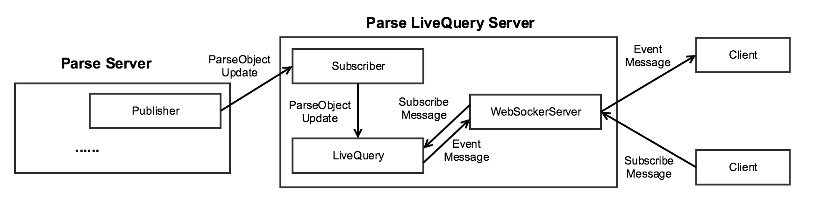
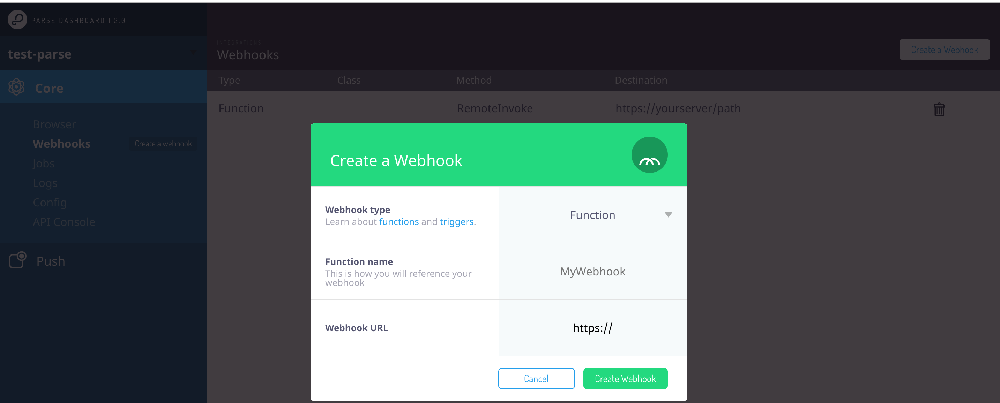

# Parse Server - 实现应用功能的利器


近年来NODEJS发展迅速，很多工程师尤其是前端工程师，用NODEJS来开发一些后端应用。同时，研发效率和研发成本成为开发者关注的重点，对于一些基础常用功能，如何避免重复开发，成为大家关注的重点，而 [Parse Server](https://parseplatform.org/) 就是抽象了常用功能的NODEJS开源项目。


首先，从整体上看看 `Parse Server` 提供了哪些基础功能:

- 用户的登录注册
- 用户身份的认证
- 数据存储 && 灵活查询
- 文件存储
- 实时查询
- 消息推送
- 缓存服务
- 与云平台很好的对接
- 自定义业务逻辑与Hook机制

## 服务快速搭建

默认情况下，Parse Server 使用的默认数据库是 `MonogDB`，所以需要提前安装该数据库。关于数据库的安装与使用不是本文的重点，暂且跳过。

```
const config = require('./config');
const app = express();

var api = new ParseServer({
  databaseURI: config.databaseURI,
  cloud: './cloud/main.js',
  appId: config.appId,
  masterKey: config.masterKey,
  // push: { ... }, // See the Push wiki page
  // filesAdapter: ..., // 对应不同云厂商的 FilesAdapter 
  // javascriptKey: config.javascriptKey, // js客户端认证
  liveQuery: { // 建立websocket链接，实现实时通信
    classNames: ['Sdtuent']
  }
});

var dashboard = new ParseDashboard({
  "apps": [
    {
      "serverURL": "http://localhost:1337/parse",
      "appId": config.appId,
      "masterKey": config.masterKey,
      "appName": "test"
    },
  ]
});

// Serve the Parse API at /parse URL prefix
app.use('/parse', api);
app.use('/dashboard', dashboard);

const port = 1337;
const httpServer = http.createServer(app);

httpServer.listen(port, function() {
  console.log('parse-server-example running on port ' + port + '.');
});

var parseLiveQueryServer = ParseServer.createLiveQueryServer(httpServer);
```

通过上述少量的代码，快速完成服务的搭建，`/parse` 是API的前缀，`/dashboard` 是后台的页面路由前缀，这样就可以快速使用 Parse Server 提供的各种功能。



## 客户端调用

针对不同环境、不同语言，parse server提供了大量的 [SDK](https://parseplatform.org/#sdks)，本文以 `javascript` 为例进行简单介绍。

```
<head>
  <script src="https://unpkg.com/parse@2.1.0/dist/parse.js"></script>
</head>
<body>
  ...
  <script>
    // 对应服务端设置的id
    Parse.initialize(${appId}, ${javascriptKey}); 
    Parse.serverURL = 'http://127.0.0.1:1337/parse'

    const username = "xxx", password = 'xxxx';
    const email = 'xxx'
    async function signup() {
      try {
        const user = new Parse.User;
        user.set('username', username);
        user.set('password', password);
        user.set('email', email);
        const result = await user.signUp();
        console.log('result is: ', result);
      } catch(err) {
        console.log('error: ', err);
      }
    }
    signup();
  </script>
</body>
```

上面的示例，是在浏览器端进行用户的注册: 首先引入`Javascript SDK`；然后进行基本的环境设置 `Parse.initialize`、`Parse.serverURL`；第三部就是使用SDK调用 `user.signUp` 完成注册。

然后到 `dashboard`，可以看到 `user` 中新增了一条记录:

```
{
    "results": [
        {
            "objectId": "1r2sFIzSRP",
            "username": "xxx",
            "createdAt": "2019-02-16T10:30:00.070Z",
            "updatedAt": "2019-02-16T10:30:00.070Z",
            "ACL": {
                "*": {
                    "read": true
                },
                "1r2sFIzSRP": {
                    "read": true,
                    "write": true
                }
            }
        }
    ]
}
```

## 重点功能介绍

### 权限控制

Parse Server的权限控制分为两层: Class level permission(类级别的权限控制)、Object level access control(对象级别的权限控制)。


```
async function saveData() {
  const Student = Parse.Object.extend("Student");
  const student = new Student();

  student.setACL(new Parse.ACL(Parse.User.current()));
  student.set("name", "小明");
  student.set("age", 12);

  const result = await student.save();
  console.log('save data: ', result);
}
async function getData() {
  const Student = Parse.Object.extend("Student");
  const query = new Parse.Query(Student);
  query.equalTo('name', '小明');
  const result = await query.find();
  console.log('save data: ', result);
}

async function run() {
  await saveData();
  await getData(); // 获得一条数据
  await Parse.User.logOut();
  // 用另外一个账号登录
  await getData(); // 结果为空
}
```
上述示例设置了 `Object level access control` ，只有拥有该 `object` 权限的用户，才能获取对应的数据。

### 数据的实时通信

要实现数据的实时通信，通常的做法是搭建一个websocket服务，客户端与服务端建立长连接，这样就可以实现数据的实时通信。`Parse Server` 也集成了这个功能，把websocket服务跟HTTP服务整合在一起，便于 client 端统一调用。



### Class的schema问题

因为 Parse Server 背后的数据存储使用的是 MongoDB，数据格式是 schemaless 的， 但是这并不是说可以随意写入数据:

- 第一次创建 `Class` 的时候，可以自定义字段及类型，同时默认添加 _id、_created_at、_updated_at、_acl 等字段
- 同时，在底层数据中，存在一个 `_SCHEMA` 集合，存储了 Class 的格式信息，约束了数据再次写入时的字段类型

为了验证上述两点，直接登录 `MongoDB` 数据库后台:

```
// step1: 登录数据库后台
mongo

// step2: 查看 collection 情况
show collections
结果如下: 
Student
_Role
_SCHEMA
_Session
_User

// step3: 查看 _SCHEMA 内容
db.getCollection('_SCHEMA').find()
结果如下:
{
    "_id":"Student",
    "objectId":"string",
    "updatedAt":"date",
    "createdAt":"date",
    "name":"string",
    "age":"number",
    "address":"string"
}
...
```
接下来对Student表进行写入操作，age的类型不是number，而使用string:

```
async function saveData() {
  const Student = Parse.Object.extend("Student");
  const student = new Student();

  student.setACL(new Parse.ACL(Parse.User.current()));
  student.set("name", "张三");
  student.set("age", '9999');
  student.set('address', '北京');

  const result = await student.save();
  console.log('save data: ', result);
}
```
执行上述代码，会抛出异常信息 `schema mismatch for Student.age; expected Number but got String`

### Cloud Code / HOOK 机制 - 实现自定义业务逻辑

如果进行业务开发，肯定存在自定义的业务逻辑，Parse Server 同样提供了对应的解决途径。

先来看看 [Cloud Code](https://docs.parseplatform.org/cloudcode/guide/) 是如何工作的:

```
// step1 在Parse Server入口处指定路径
var api = new ParseServer({
  ...
  cloud: './cloud/main.js',
  ...
});
// step2 定义一般的Function
Parse.Cloud.define("averageStars", async (request, response) => {
  const params = request.params;
  ...
  const result = ...
  response.success(result);
});
// 定义hook函数
Parse.Cloud.beforeSave("Student", (request) => {
  ...
});
// step3 客户端调用自定义函数方式
async function invokeFn() {
  const params =  {  ... };
  const ratings = await Parse.Cloud.run("averageStars", params);
  console.log('ratings: ', ratings);
}
// 客户端出发hook比较简单，对Student进行写入，就会触发hook函数
async function saveData() {
  const Student = Parse.Object.extend("Student");
  const student = new Student();
  ...
  const result = await student.save();
}
```
同时，Parse Server 也支持远程调用，使用 Dashboard 的 Webhook功能，就可以配置远程调用API



## 思考总结

Parse Server这个开源项目给了不少项目设计上的思考:

- 具体功能抽象，把一些常用功能抽象出来，是研发提效的一个很重要的手段
- server + client模式，抽象出业务模型之后，如果只是解决了某一部分的问题(例如server)，使用成本依然很高，但是如果解决更多链路上的问题，那就会变得更加容易使用和落地。Parser Server不仅提供了server端的实现，而且提供了Dashboard、Client、Adapter等内容
- hook功能，用于解决个性化需求，满足业务定制
- 与云的结合，目前已成为未来技术选型的一个很大趋势，Parse Server 的文件存储，提供了很多云存储相关的 Adapter，快速实现跟云产品的对接
- 权限控制设计，数据的安全已经成为研发很重要的一个工作，分级控制是个思路
